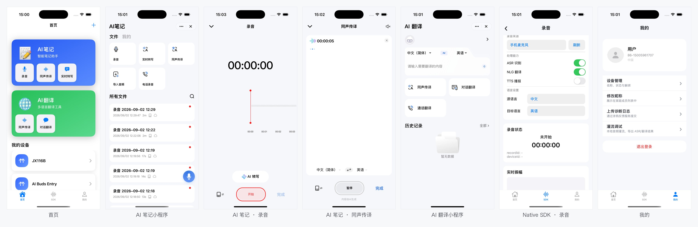

# Tuya AI Audio iOS Demo

**中文说明请参阅 [README.zh-CN.md](README.zh-CN.md)。**

## Project Overview

The AI Audio UI Biz Bundle enables ordinary Bluetooth headsets, glasses, speakers, and other audio products to be upgraded into AI products with AI note-taking and translation. It uses a professional recording algorithm with advanced language models for real-time transcription and translation in 100+ languages worldwide.

This Demo shows two integration approaches. Pick one, or combine both:

| Approach | Description | Demo entry |
|----------|-------------|-----------|
| **UI Biz Bundle (mini program panel)** | Reuse the AI Notes / AI Translation mini program panels provided by Tuya. UI and business logic are maintained by Tuya — lowest integration cost. | Home tab |
| **Native SDK (custom UI)** | Build your own recording, transcription, summary, and translation screens on the `ThingAudioRecordInterface` native APIs. Full UI control. | SDK tab |

Before integrating this biz bundle, complete [Preparation](https://developer.tuya.com/cn/docs/app-development/preparation?id=Ka8j28bikfqkf) and [Framework Integration](https://developer.tuya.com/cn/docs/app-development/framework?id=Ka8j2895qdvtj).

Demo: [tuya-aivoice-ios-sdk-sample-objc](https://github.com/tuya/tuya-aivoice-ios-sdk-sample-objc).

## Feature Overview

| Tab / Entry | Screen | Capabilities | Key implementation |
|-------------|--------|--------------|--------------------|
| Home | Home | AI Notes / AI Translation mini program cards with shortcuts (recording, simultaneous interpretation, real-time transcription, dialogue translation), device list, tap a device to open its panel | `MainViewController`, `MiniAppRoutes.h`, `DeviceListView` |
| Home → top-right + | Add device | Standard provisioning (Tuya UI) or custom BLE single-point provisioning | `ActivatorService`, `CustomBLEPairingViewController`, `CustomBLEPairingSession` |
| SDK | Recording | Audio source (phone mic / paired device), ASR / NLG translation / TTS switches, source and target language (14 each), live waveform, start / pause / resume / stop, live ASR and translation text, SDK event log | `NativeSDKViewController`, `NativeAudioService` |
| SDK → Record list | Record list | All stored recordings, mixed search over title, tags, and transcription | `NativeRecordListViewController` |
| SDK → Record detail | Record detail | Transcription, summary, translation, audio playback and amplitude; trigger offline transcribe / summarize / translate tasks | `NativeRecordDetailViewController` |
| Me | Personal settings | User info, rename nickname, device management, diagnostic logs, perfusion debugging, logout | `MineViewController` |
| Me → Device management | Device management | Refresh devices in the current home, online status, rename, remove | `DeviceManagementViewController`, `DeviceService` |
| Me → Perfusion debugging | Perfusion debugging | Feed a local audio file into the recording pipeline instead of the mic to exercise ASR / translation / TTS, compute WER, and export an HTML report | Standalone `ThingPerfusionKit` component |
| Launch | Login / Register | Login: phone / email + password. Register: phone / email + verification code (with countdown) + password. Searchable country picker | `LoginViewController`, `RegisterViewController`, `AuthService`, `CountryPickerViewController` |

## Screenshots



Full-size individual shots:

| # | Screen | Image | Description |
|---|--------|-------|-------------|
| 1 | Home | [01-home.png](Screenshot/01-home.png) | AI Notes / AI Translation cards with shortcuts, and the current home's device list |
| 2 | AI Notes mini program | [02-ainote-miniapp.png](Screenshot/02-ainote-miniapp.png) | Mini program home: recording, real-time transcription, simultaneous interpretation, audio import, call recording, and the file list |
| 3 | AI Notes · Recording | [03-ainote-recording.png](Screenshot/03-ainote-recording.png) | Mini program recording screen with AI transcription |
| 4 | AI Notes · Interpretation | [04-ainote-interpretation.png](Screenshot/04-ainote-interpretation.png) | Simultaneous interpretation while recording; source and target language switch at the bottom |
| 5 | AI Translation mini program | [05-aitranslate-miniapp.png](Screenshot/05-aitranslate-miniapp.png) | Text translation, simultaneous interpretation, dialogue translation, call translation, and history |
| 6 | Native SDK · Recording | [06-native-sdk-record.png](Screenshot/06-native-sdk-record.png) | Custom recording screen: audio source, ASR / NLG / TTS switches, languages, state, and live waveform |
| 7 | Me | [07-mine.png](Screenshot/07-mine.png) | User info, device management, nickname, diagnostic logs, perfusion debugging, logout |

> Shots 2–5 are Tuya mini program panels (the UI biz bundle approach); shot 6 is the Native SDK custom-UI approach.

## For AI assistants: Integration skill

When you use **Cursor**, **Claude Code**, or similar agents to integrate the Tuya AI Audio UI biz bundle on iOS, load the companion skill **[`aivoice-integration/SKILL.md`](aivoice-integration/SKILL.md)** (skill id: `tuya-aivoice-ios-integration`). It includes a decision tree, CocoaPods and config steps, SDK initialization, login, home and device flows, provisioning, and mini program routing aligned with this repo.

- **Cursor**: Add the skill under your user or project skills directory when working in this repo, or attach [`aivoice-integration/SKILL.md`](aivoice-integration/SKILL.md) in integration-related chats.
- **Tip**: Have the agent read that file first so guidance stays consistent with `MARK: AIVoice` comments and the sections below.

## Developer Notes: MARK: AIVoice

1. Important integration, configuration, and business-logic notes in the project are marked in source with **`MARK: AIVoice`**.
   **When integrating, search the project for `MARK: AIVoice` and read each comment** to avoid misconfiguration or misuse.

2. Ensure the local `ios_core_sdk/` directory contains the `ThingSmartCryption` security component and that the project includes `thing_custom_config.json`. The `ios_core_sdk/` directory is ignored by Git and must be obtained from the Tuya Developer Platform for local use.

## Requirements and Dependencies

| Item | Requirement |
|------|-------------|
| Xcode | 15 or later |
| Deployment target | iOS 13.0+ |
| Dependency manager | CocoaPods (`use_frameworks! :linkage => :static`, `use_modular_headers!`) |
| Tuya biz bundle version | 7.8.x |

Tuya dependencies declared directly by the Demo (see [Podfile](Podfile)):

| Pod | Purpose | Required |
|-----|---------|----------|
| `ThingSmartCryption` | Local security component; obtain it from the Developer Platform and place it in `ios_core_sdk/` | Yes |
| `ThingSmartAIVoiceBizBundle` | AI Audio UI biz bundle (also brings in the `ThingAudioRecordInterface` native APIs) | Yes |
| `ThingSmartHomeKit` | Home, device, and user fundamentals | Yes |
| `ThingSmartMiniAppBizBundle` / `ThingSmartBaseKitBizBundle` / `ThingSmartBizKitBizBundle` | Mini program container and base biz bundles | Yes |
| `ThingSmartFamilyBizBundle` | Home management UI biz bundle | Optional |
| `ThingSmartActivatorBizBundle` | Device provisioning UI biz bundle | Skip if you do not provision devices |
| `ThingSmartBusinessExtensionKit` / `ThingSmartBusinessExtensionKitBLEExtra` | Needed for custom BLE single-point provisioning (declared explicitly instead of relying on transitive UI biz bundle dependencies) | Custom provisioning only |
| `ThingSmartPanelBizBundle` | Device panel UI biz bundle | Skip if you do not control devices |
| `ThingSmartDeviceDetailBizBundle` | Device detail UI biz bundle | Optional |
| `ThingSmartOTABizBundle` | Device OTA UI biz bundle (commented out in the Podfile) | Optional |
| `ThingPerfusionKit` | Perfusion debugging component, referenced by local path `../Modules/ThingPerfusionKit` (**not inside this repo**) | Perfusion debugging only |

## Getting Started

1. Clone this repository.
2. Download the security component from the Tuya Developer Platform and place the `ThingSmartCryption` files into `ios_core_sdk/` (the directory is Git-ignored).
3. Fill in `APP_KEY` and `APP_SECRET_KEY` in [`tuya-aivoice-ios-sdk-sample-objc/AppKey.h`](tuya-aivoice-ios-sdk-sample-objc/AppKey.h).
4. Fill in `appId` and `thingAppKey` in [`tuya-aivoice-ios-sdk-sample-objc/thing_custom_config.json`](tuya-aivoice-ios-sdk-sample-objc/thing_custom_config.json).
5. Run `pod install`, then open `tuya-aivoice-ios-sdk-sample-objc.xcworkspace` and build.

> The bundle identifier and `appScheme` must match what you registered when creating the AppKey on the Tuya Developer Platform, otherwise SDK initialization fails.

### About thing_custom_config

```json
{
    "config":
    {
        "appId":"",
        "thingAppKey":"",
        "appScheme":"AIVoiceDemo",
        "needBle":true,
        "is_support_home_manager":true,
        "need_backgroud_audio":true,
        "needQRCode": true,
        "device_detail_mini_program": true,
        "hotspotPrefixs": ["AAA", "BBB"],
        "support_ble_gpt": true
    },
    "colors": {
        "themeColor": "#FFA228"
    },
    "blackColors": {
        "themeColor": "#FF5A28",
        "backgroundColor": "#000000",
        "warningColor": "#FF4444",
        "tipsColor": "#2DDA86",
        "guideColor": "#1989FA",
        "navigationBarColor": "#1A1A1A",
        "tabBarSelectedColor": "#FF5A28",
        "alertMaskAlpha": 0.7
    }
}
```

**Parameter overview**

| Parameter | Description | Type | Required | Default |
|-----------|-------------|------|----------|---------|
| appId | App ID from Tuya Developer Platform: open your app/SDK page; the `id` in the page URL is appId (e.g. https://platform.tuya.com/oem/app?id=888888 → appId is 888888) | Number | Yes | — |
| thingAppKey | AppKey for the SDK in Tuya Developer Platform | String | Yes | — |
| appScheme | Channel identifier for the SDK in Tuya Developer Platform | String | Yes | — |
| hotspotPrefixs | Hotspot name prefix for device provisioning | Array | No | ["SmartLife"] |
| needBle | Whether to support BLE device provisioning | Boolean | No | true |
| support_ble_gpt | Whether to enable BLE GPT capabilities | Boolean | No | true |
| themeColor | UI theme color | String | No | #FF5A28 |

### Permissions and Background Modes

The Demo declares the following in build settings (`INFOPLIST_KEY_*`) and [`Info.plist`](tuya-aivoice-ios-sdk-sample-objc/Info.plist). Keep the ones your app needs:

| Key | Purpose |
|-----|---------|
| `NSMicrophoneUsageDescription` | Recording (needed by both the Native SDK and the mini program panel) |
| `NSBluetoothAlwaysUsageDescription` | BLE device discovery and provisioning |
| `NSBluetoothPeripheralUsageDescription` | Bluetooth permission compatible with iOS 12 and earlier |
| `NSCameraUsageDescription` | Scan a QR code to add a device |
| `NSLocationWhenInUseUsageDescription` | Location when creating a home |
| `NSPhotoLibraryUsageDescription` | Photo library access |
| `UIBackgroundModes: audio` | Background recording; use together with the `need_backgroud_audio` config |

---

## Tuya Architecture

Tuya iOS biz bundles are exposed as services; all features are provided via protocols.


Before integrating the Tuya SDK, you should understand these concepts.

### Home

A **home** is the abstraction for a whole-home smart scenario: devices, accounts, and permissions for a single "home" or place.
Main capabilities: list homes, get devices/groups under a home, add/update/remove homes, rooms, and members.

| Class / Protocol        | Description |
|-------------------------|-------------|
| `ThingSmartHomeManager` | List homes, sort homes, add home |
| `ThingSmartHome`         | Single-home management (initialized with `homeId`) |
| `ThingSmartHomeDelegate` | Callbacks for home changes (devices, rooms, dps, etc.) |

You must initialize `ThingSmartHome` and call **get home detail** before `homeModel`, `roomList`, `deviceList`, `groupList`, etc. are populated. Then **set the current home**; the class that owns the home must conform to `<ThingFamilyProtocol>`.

```objc
// 1. Get home list (basic info only)
[self.homeManager getHomeListWithSuccess:^(NSArray<ThingSmartHomeModel *> *homes) {
    // If no homes, create one via addHomeWithName:geoName:rooms:latitude:longitude:success:failure:
} failure:^(NSError *error) { }];

// 2. Init current home and fetch detail (required before deviceList is available)
self.home = [ThingSmartHome homeWithHomeId:homeId];
[self.home getHomeDataWithSuccess:^(ThingSmartHomeModel *homeModel) {
    // Now self.home.deviceList / groupList / roomList etc. have data

    // 3. Set the current home
    [[ThingSmartBizCore sharedInstance] registerService:@protocol(ThingFamilyProtocol) withInstance:self];
    id<ThingFamilyProtocol> impl = [[ThingSmartBizCore sharedInstance] serviceOfProtocol:@protocol(ThingFamilyProtocol)];
    if ([impl respondsToSelector:@selector(updateCurrentFamilyId:)]) {
        [impl updateCurrentFamilyId:homeId];
    }
} failure:^(NSError *error) { }];
```

- Docs: [Home Management](https://developer.tuya.com/cn/docs/app-development/home?id=Ka5d52ey6e58h), [Home Info](https://developer.tuya.com/cn/docs/app-development/iOS_family?id=Kaixeor409hck)

### Device

Devices are bound to a home after provisioning. Before device operations, ensure you have loaded home detail for that home (see above) so the device list and device instances are correct.

| Class                     | Description |
|---------------------------|-------------|
| `ThingSmartDevice`        | Device control and management (rename, remove, publish DP, etc.) |
| `ThingSmartDeviceModel`   | Device data (devId, name, dps, online status, etc.) |

```objc
// Device list comes from home after getHomeDataWithSuccess
NSArray *deviceList = [self.home.deviceList copy];

// Init device by devId (user must own device and home detail must be synced)
ThingSmartDevice *device = [ThingSmartDevice deviceWithDeviceId:devId];
device.delegate = self;  // Listen for dps updates, device info, removal, etc.

// Open device panel (mini program panel)
ThingSmartDevice *smartDevice = [ThingSmartDevice deviceWithDeviceId:device.devId];
id<ThingPanelProtocol> impl = [[ThingSmartBizCore sharedInstance] serviceOfProtocol:@protocol(ThingPanelProtocol)];
if (impl) {
    [impl gotoPanelViewControllerWithDevice:smartDevice.deviceModel group:nil initialProps:nil contextProps:nil completion:nil];
}
```

- Docs: [Device Management](https://developer.tuya.com/cn/docs/app-development/device?id=Ka5cgmmjr46cp)

### Home and Device Relationship

**Devices are home-scoped.** All devices belong to a home. Before using device features (list devices, control devices, etc.), the user **must have at least one home**. If there is no home, create one, **set the current home**, and **load home detail**; only then can devices be listed and controlled.

---

## Quick Reference: Important Notes

### 1. Preparation

- **Where**: `thing_custom_config.json` & `AppKey.h`
- **What**: Ensure AppKey, APPSecretKEY, and APPID from the Tuya IoT platform are set in these config files.
- **Docs**: [SDK Preparation](https://developer.tuya.com/cn/docs/app-development/preparation?id=Ka69nt983bhh5)

### 2. SDK Initialization (AppDelegate.m)

- **Where**: `application:didFinishLaunchingWithOptions:`
- **What**: Initialize the Tuya SDK at app launch (`startWithAppKey:secretKey:`). Also initialize the mini program container (`[[ThingMiniAppClient initialClient] initialize]`) and forward `application:didFinishLaunchingWithOptions:` to `ThingModuleManager` so biz bundles can register their services.
- **Docs**: [Integrate SDK](https://developer.tuya.com/cn/docs/app-development/integrate-sdk?id=Ka5d52ewngdoi)

### 3. Mini Program Routes (MiniAppRoutes.h)

- **What**: Demo mini program entry URLs and AppIDs are defined as constants in `MiniAppRoutes.h` (AI Notes: recording, simultaneous interpretation, real-time transcription; AI Translation: simultaneous interpretation, dialogue translation).
- **Note**: If you use different mini programs or paths, update the constants here to match Tuya platform configuration to avoid navigation failures.

### 4. Login / Auth (AuthService.m)

- **What**: Login, registration, verification code, and password reset examples live in this service, covering both phone and email:
  - Verification code: `getWhiteListWhoCanSendMobileCodeSuccess:failure:` for available regions, `sendVerifyCodeWithUserName:...` to send, `checkCodeWithUserName:...` to verify; the type distinguishes register / login / reset password.
  - Phone: password login `loginByPhone:...`, code login `loginByPhoneWithCode:...`, registration `registerByPhone:...`, reset `resetPasswordByPhone:...`.
  - Email: the matching `loginByEmail:...`, `loginByEmailWithCode:...`, `registerByEmail:...`, `resetPasswordByEmail:...`.
  - `registerWithCountryCode:account:password:code:...` detects automatically whether the account is an email or a phone number.
- **Country picker**: `CountryModel` ships a country list grouped by region (China / Asia-Pacific / Americas / Europe / Middle East & Africa). `CountryPickerViewController` provides a searchable picker and remembers the last selection, so users never type a country code.
- **Wired into the Demo UI**: the login screen uses password login only (`loginByPhone:` / `loginByEmail:`); the register screen uses verification code + password. Code login and password reset are available in `AuthService` and can be wired into your own UI.
- **Note**: Choose the right auth flow for your app and handle token, user info, and logout correctly.
- **Docs**: [User & Account](https://developer.tuya.com/cn/docs/app-development/user?id=Ka5cgmm97jlt2)

### 5. Device Provisioning (ActivatorService.m)

- **What**: Examples for Wi-Fi, Bluetooth, and other provisioning flows.
- **Note**: Different products may use different provisioning APIs; choose the right one and handle timeouts and errors.
- **Docs**: [Device Provisioning](https://developer.tuya.com/cn/docs/app-development/activator?id=Ka5cgmlzpfig4)

#### Custom BLE Single-Point Provisioning

The add button in the upper-right corner provides two provisioning methods:

- **Standard provisioning** opens the Tuya provisioning UI through `ActivatorService`.
- **Custom provisioning** opens `CustomBLEPairingViewController` and uses `CustomBLEPairingSession` for BLE discovery, token acquisition, and activation.

The custom flow is: validate login and the current `homeId` → scan for BLE devices → let the user select one device → request a fresh token → activate → refresh the home device list. It supports one BLE single-point device at a time. BLE-Wi-Fi dual-mode, EZ/AP, Mesh, Beacon, Matter, and sub-device provisioning are outside this flow.

Implementation paths:

- `Services/Pairing/CustomBLEPairingSession.h/.m`: state machine, SDK adapter, error mapping, cancellation, and cleanup.
- `Views/Activator/CustomBLEPairingViewController.h/.m`: scan list, selection, activation result, and in-memory page log.
- `tuya-aivoice-ios-sdk-sample-objcTests/CustomBLEPairingSessionTests.m`: state-transition and error-handling tests with a fake adapter.

Custom BLE provisioning explicitly depends on `ThingSmartBusinessExtensionKit` and `ThingSmartBusinessExtensionKitBLEExtra`. Configure `NSBluetoothAlwaysUsageDescription` and the iOS 12-compatible `NSBluetoothPeripheralUsageDescription` before real-device testing. Provisioning runs only while the page is in the foreground; leaving the page stops scanning and activation.

### 6. Open Mini Program Panel (MainViewController.m)

- **What**: To open the Tuya standard device panel when tapping a device in the list, use `gotoPanelViewControllerWithDevice`.
- **Note**: For a custom panel, add the `ThingSmartPanelBizBundle` UI biz bundle in the Podfile.
- **Docs**: [Open Panel](https://developer.tuya.com/cn/docs/app-development/devicecontrol?id=Ka8qf8lnahsf8#title-9-%E6%89%93%E5%BC%80%E9%9D%A2%E6%9D%BF)

### 7. Load Home List (MainViewController.m - loadHomeList)

- **What**: The Tuya SDK manages devices and permissions by **home**, so **at least one home is required** for device features.
- **Note**: You can create a default home on first launch or after registration (see Demo); for multiple homes, implement list and switch logic.
- **Docs**: [Home Management](https://developer.tuya.com/cn/docs/app-development/home?id=Ka5d52ey6e58h)

### 8. Set Current Home (MainViewController.m - initCurrentHome)

- **What**: After creating or selecting a home, **set the current home** (e.g. via `updateCurrentFamilyId`) so the SDK loads device list and permissions for that home.
- **Note**: With a single home, call update current home during home or device-list init to avoid an empty list or permission issues.

### 9. Native SDK Recording Pipeline (NativeSDKViewController.m / NativeAudioService.m)

- **Entry**: the SDK tab.
- **What**: If you do not use the mini program panel, build your own recording UI on `ThingAudioRecordInterface` (shipped with `ThingSmartAIVoiceBizBundle`). The Demo wraps `ThingAudioDetectManagerNative` in `NativeAudioService` and guarantees that every callback is delivered on the main thread.
- **Capabilities**:
  - Audio source: phone microphone (`ThingSystemMic16KMono`) or a paired audio device in the current home.
  - Processing switches: ASR, NLG translation, TTS playback.
  - Languages: 14 common languages each for source and target (zh/en/ja/ko/fr/de/es/ru/it/pt/th/vi/ar/hi).
  - Recording control: start, pause, resume, stop, with a live waveform plus state and duration readouts.
  - Live results: streaming ASR text, streaming translation text, and an SDK event log.
- **Note**: `addRecordListener:deviceId:` and `removeRecordListener:deviceId:` must be paired with the same instance and the same `deviceId`, otherwise callbacks leak.

### 10. Record List and Detail (NativeRecordListViewController.m / NativeRecordDetailViewController.m)

- **Entry**: the record list card at the top of the SDK tab.
- **List**: all stored recordings sorted by `recordTime` descending, with mixed search over title, tags, and transcription.
- **Detail**: transcription, summary, translation, audio playback, and amplitude curve; you can re-run offline tasks on a recording (`taskType`: 0 transcribe, 1 summarize, 2 translate).
- **What**: Content is fetched via `fetchTranscriptionWithFileId:`, `fetchSummaryWithFileId:`, and `fetchTranscriptionSentencesWithFileId:`; the sentence API carries timestamps, so you can render sentence by sentence and seek playback.

### 11. Perfusion Debugging and Test Reports (ThingPerfusionKit)

- **Entry**: Me → Perfusion debugging.
- **Componentized**: perfusion has been extracted from the Demo app into a standalone local component, `ThingPerfusionKit`, referenced from the Podfile by local path:

  ```ruby
  pod 'ThingPerfusionKit', :path => '../Modules/ThingPerfusionKit'
  ```

  | Subspec | Contents | Dependencies |
  |---------|----------|--------------|
  | `Core` | Perfusion config provider, WAV format validation, WER computation, report generation (no UI) | `ThingAudioRecordInterface`, `ThingModuleManager`, `ThingAnnotationFoundation` |
  | `UI` | Ready-made perfusion debugging screen (ships its own base view controller) | `Core` + UIKit / AVFAudio |

  All three dependencies are already transitive dependencies of the AI Audio biz bundle, so no new pod is required. Integrate `ThingPerfusionKit/Core` alone if you want the capability without the screen.

  > ⚠️ `../Modules/ThingPerfusionKit` lives outside this repository. If you clone this repo alone, that path does not exist and `pod install` fails — obtain the module as well, or comment out this line (the perfusion entry then becomes unavailable).

- **How it works**: perfusion **replaces microphone capture with a local audio file** fed into the recording pipeline, so you can reproduce and regress the whole ASR / translation / TTS flow without making a sound. When `ThingMicrophoneAudioInput` starts audio input, it reads three settings back from the app through `ThingAIBudsDebuggerProtocol`: the perfusion switch, the file name, and whether to auto-finish.
- **No startup registration**: the component uses `ThingRegisterAPIAnnotation` to write its config provider into the `_ThingMOV3_` Mach-O section at compile time; `ThingMachRegister` collects it at launch, so no registration code is needed in `AppDelegate`. `registerProvider` / `isProviderReady` / `configFetchCount` exist only for self-checks and troubleshooting.
- **Main APIs**:
  - `ThingPerfusionViewController`: the ready-made debugging screen — just push it.
  - `ThingPerfusionService`: perfusion switch, file name, auto-finish, end callback, and management of perfusion audio and reference files.
  - `ThingPerfusionWERCalculator`: standalone WER evaluation, usable without perfusion.
  - `ThingPerfusionReportBuilder`: HTML test report generation.
  - `ThingPerfusionAudioFileInfo`: WAV format parsing and validation.
- **Directory layout** (all under the app sandbox Documents; handled by the component):
  - Perfusion audio: `voiceRecord/automaticTest/audioFiles`
  - Reference answers: `voiceRecord/automaticTest/references` (`.txt`)
  - Test reports: `voiceRecord/automaticTest/reports` (`.html`)
- **Audio format requirement (the most common pitfall)**: the SDK treats the file as **16 kHz / 16-bit / mono integer PCM** and swaps it straight into the capture stream, so **only integer-PCM WAV works** (WAV `audioFormat` field 1; 3 is IEEE float and is not supported). The typical symptom of a wrong format is "perfusion runs but no ASR output at all". Convert with:

  ```bash
  afconvert -f WAVE -d LEI16@16000 -c 1 input.wav output.wav
  ```

  The component validates the file and the screen reacts in three tiers: fully compliant starts directly; PCM with a mismatched sample rate / channel count / bit depth warns and lets you start anyway; non-PCM or non-WAV is blocked outright with the conversion command shown.
- **WER definition**: `WER = (S + D + I) / N`, accuracy = 1 − WER. Text is normalized first (lowercase, punctuation replaced by spaces rather than deleted, per-character Chinese segmentation, filler removal, thousands-separator and numeral normalization), then aligned with edit distance to obtain S/D/I. Verified item by item against the team's existing `ASR_WER/WER.py` on real data.
- **Report contents**: KPI overview (accuracy / WER / reference word count / total errors / elapsed time), error composition, test conditions, per-sentence comparison, full-text per-word comparison (substitutions red, insertions yellow, deletions green), normalized text, and an explanation of the computation. Single-file HTML with dark mode support.
- **Note**: per-sentence comparison never splits one recognized segment across multiple reference lines, so when ASR merges several reference lines into one segment some reference lines are counted as missed; the report flags this. **Full-text WER is unaffected and is the authoritative number.** Call `reset` when done so later normal recordings are unaffected.

### 12. Device Management

- **Entry**: Me → Device Management.
- **Implementation**: `DeviceManagementViewController` and `DeviceService`.
- **Capabilities**: refresh devices in the current home, display online status, rename a device, and remove a device from the current home.

### 13. Personal Settings

- **Entry**: the Me tab.
- **Capabilities**: display the current user, update the nickname, open device management, open diagnostic log submission, open perfusion debugging, and log out.
- **Note**: The screen uses the Demo's custom UI components (`FamilyBaseViewController` provides shared navigation, card, and dialog styling); operation results come from the Tuya SDK.

### 14. Diagnostic Log Entry

- **Entry**: Me → Upload Diagnostic Logs.
- **Implementation**: use `ThingFeedBackProtocol` to open the Tuya feedback screen, where the user confirms the issue description and submitted information.
- **Note**: If the feedback module or protocol service is unavailable, the Demo displays an unavailable message and does not create repository log files.

---

## Project Structure

```
tuya-aivoice-ios-sdk-sample-objc/
├── AppDelegate.m/.h           # SDK initialization (MARK: AIVoice)
├── SceneDelegate.m/.h         # Root view switching (login / main tab bar)
├── AppKey.h                   # AppKey / SecretKey
├── thing_custom_config.json   # Biz bundle configuration
├── MiniAppRoutes.h            # Mini program AppIDs and shortcut URLs (MARK: AIVoice)
├── LoginViewController.m/.h   # Login screen
├── Models/
│   └── CountryModel.m/.h      # Country / region data
├── Services/
│   ├── AuthService.m/.h       # Login and registration (MARK: AIVoice)
│   ├── ActivatorService.m/.h  # Provisioning (MARK: AIVoice)
│   ├── DeviceService.m/.h     # Device management
│   ├── NativeAudioService.m/.h        # Native recording SDK wrapper
│   └── Pairing/
│       └── CustomBLEPairingSession.m/.h  # Custom BLE provisioning state machine
├── Views/
│   ├── Main/                  # Home and tab bar
│   ├── Auth/                  # Registration, country picker
│   ├── NativeSDK/             # Recording, record list, record detail
│   ├── Device/                # Device list and device management
│   ├── Activator/             # Custom BLE provisioning screen
│   ├── Mine/                  # Me
│   └── Common/                # FamilyBaseViewController shared UI base class
└── Utils/
    └── UIHelper.m/.h
```

Perfusion debugging code is not in this repository; it lives in a sibling standalone component:

```
../Modules/ThingPerfusionKit/
├── ThingPerfusionKit.podspec
├── README.md
└── ThingPerfusionKit/Classes/
    ├── Core/    # ThingPerfusionService / WERCalculator / ReportBuilder / AudioFileInfo / RecordBridge
    └── UI/      # ThingPerfusionViewController / ThingPerfusionBaseViewController
```
