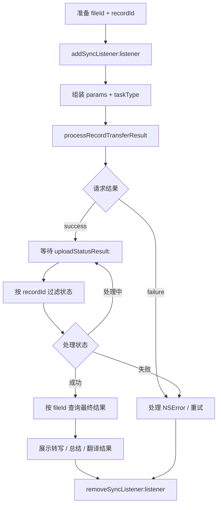

# 涂鸦 iOS Native SDK 转写 / 总结 / 翻译调用流程

本文只描述对外暴露的 Native SDK 调用方式。调用方直接使用
`ThingAudioDetectManagerNative`，通过 `ThingAudioRecordSyncManagerDelegate` 接收异步状态；
本文不包含任何页面、业务容器或宿主内部实现。

## 1. 调用边界

转写、总结和翻译都是异步任务，调用链由四部分组成：

1. 调用方准备同一条录音的 `fileId` 和 `recordId`。
2. 调用方先注册 `ThingAudioRecordSyncManagerDelegate`。
3. 调用 `processRecordTransferResult:taskType:progress:success:failure:` 发起任务。
4. 通过 `uploadStatusResult:` 判断最终状态，成功后再查询正式结果。

接口 `success` 只表示请求已经提交，不能作为 AI 处理完成事件。最终完成状态必须以
`uploadStatusResult:` 中对应状态字段为准。

## 2. 完整流程图



图中 `taskType` 为 `0` 转写、`1` 总结、`2` 翻译；总结或翻译必须在正式转写完成后发起。
具体状态字段和结果查询方法见下文参数表与状态表。

### 2.1 监听时序要求

- 必须先调用 `addSyncListener:`，再发起处理任务，避免错过快速返回的状态事件。
- 监听器移除时必须传入注册时的同一个对象实例。
- `uploadStatusResult:` 可能同时返回多条录音的状态，必须使用 `recordId` 过滤，不能使用
  `fileId` 过滤。
- Delegate 回调线程由底层 SDK 决定；更新 UIKit 前切换到主线程。
- 页面或业务对象结束使用时调用 `removeSyncListener:`，避免重复监听和消息泄漏。

## 3. 发起任务接口

```objc
- (nullable NSString *)processRecordTransferResult:(ThingAudioRecordUploadFileParams *)params
                           taskType:(NSInteger)taskType
                           progress:(nullable void (^)(double progress, int status))progress
                            success:(nullable ThingAudioDetectNativeSuccess)success
                            failure:(nullable ThingAudioDetectNativeFailure)failure;
```

### 3.1 `taskType`

| 值 | 类型 | 说明 |
| --- | --- | --- |
| `0` | 转写 | 将录音转换为正式文字结果；总结和翻译依赖该结果 |
| `1` | 总结 | 基于正式转写生成总结文本 |
| `2` | 翻译 | 基于正式转写生成目标语言文本 |

### 3.2 `ThingAudioRecordUploadFileParams` 参数

| 字段 | Objective-C 类型 | 转写 `0` | 总结 `1` | 翻译 `2` | 含义 |
| --- | --- | --- | --- | --- | --- |
| `fileId` | `long long` | 必填 | 必填 | 必填 | 本地录音文件主键，用于发起任务和查询结果 |
| `recordId` | `NSString *` | 必填 | 必填 | 必填 | 业务录音唯一 ID，用于 Delegate 状态过滤 |
| `language` | `NSString *` | 建议 | 可选 | 可选 | ASR 倾向语言，例如 `@"zh"`；不是翻译目标语言 |
| `enableSpeaker` | `BOOL` | 可选 | 可选 | 不使用 | 是否启用说话人识别 |
| `templateCode` | `NSString *` | 不使用 | 可选 | 不使用 | 总结模板编码；为空时使用服务端默认模板 |
| `summaryLang` | `NSString *` | 不使用 | 建议 | 不使用 | 总结输出语言，例如 `@"zh"` |
| `transLang` | `NSString *` | 不使用 | 不使用 | 必填 | 翻译目标语言，例如 `@"en"` |

`fileId` 和 `recordId` 必须来自同一条录音。语言编码必须使用底层 SDK/服务端支持的编码，
示例中的 `zh`、`en` 仅表示常用语言编码。

### 3.3 回调含义

| 回调 | 含义 |
| --- | --- |
| `progress(progress, status)` | 文件上传进度回调；`progress` 为上传进度，`status` 为上传状态。它只表示上传过程，不能替代 AI 最终状态事件 |
| `success` | 请求已提交；不表示转写、总结或翻译已经完成 |
| `failure(error)` | 请求阶段失败，例如参数、网络或服务不可用；包含 `NSError` |

`status` 使用 `ThingAudioRecordProcessStatus`：`0` 开始、`1` 更新、`2` 上传结束、`3` 取消。

转写任务可能在 `success` 前后返回任务 ID（具体以当前 SDK 实现为准）；总结和翻译的最终
完成同样必须依赖 Delegate 状态。

### 3.4 任务依赖

总结和翻译应基于正式转写结果发起：

- 如果当前录音尚未完成正式转写，先以 `taskType = 0` 发起转写。
- 收到 `transferStatus = 2` 后，再以 `taskType = 1` 或 `taskType = 2` 发起总结/翻译。
- 如果录音已经存在正式转写结果，可以直接发起总结或翻译。

## 4. Delegate 监听接口

```objc
@protocol ThingAudioRecordSyncManagerDelegate <NSObject>
@optional
- (void)uploadStatusResult:(ThingFileUpdateStatusResult *)result;
@end
```

注册和移除使用对外 Native 入口：

```objc
ThingAudioDetectManagerNative *manager =
    [ThingAudioDetectManagerNative sharedInstance];

[manager addSyncListener:listener];
// 业务结束时：
[manager removeSyncListener:listener];
```

### 4.1 `uploadStatusResult:` 状态字段

调用方只处理 `recordId` 匹配的 `ThingFileUpdateStatusItem`：

| 字段 | 状态值 | 处理方式 |
| --- | --- | --- |
| `transferStatus` | `0` 未转写，`1` 处理中，`2` 成功，`3` 失败 | `2` 后查询正式转写；`3` 展示失败并允许重试 |
| `summaryStatus` | `0` 旧数据，`1` 未总结，`2` 处理中，`3` 成功，`4` 失败 | `3` 后查询总结；`4` 展示失败并允许重试 |
| `translateStatus` | `0` 未翻译，`1` 处理中，`2` 成功，`3` 失败 | `2` 后查询含译文的正式转写；`3` 展示失败并允许重试 |

`uploadStatusResult:` 的失败状态没有单独的 `NSError`。调用方应使用状态字段展示业务错误，
并在需要时重新发起对应 `taskType`。

## 5. 最终结果查询

只有状态进入成功值后才查询结果：

```objc
// transferStatus == 2，或 translateStatus == 2
- (void)getRecordTransferRecognizeResult:(long long)fileId
                                 success:(nullable void (^)(NSString *text))success
                                 failure:(nullable ThingAudioDetectNativeFailure)failure;

// summaryStatus == 3
- (void)getRecordTransferSummaryResult:(long long)fileId
                               success:(nullable void (^)(NSString *text))success
                               failure:(nullable ThingAudioDetectNativeFailure)failure;
```

- `getRecordTransferRecognizeResult:` 返回正式转写文本；翻译成功后，同一接口返回包含译文的正式结果。
- `getRecordTransferSummaryResult:` 返回总结文本。
- 结果查询失败通过 `failure` 返回 `NSError`，查询成功的文本可能为空字符串，调用方应按空文本处理。

## 6. 可直接使用的 Native 调用示例

以下代码只依赖对外 Native API 和公开 Delegate，不依赖 Demo 页面或其他内部对象：

```objc
#import <TUniAudioDetectManager/ThingAudioDetectManagerNative.h>

@interface AudioProcessClient : NSObject <ThingAudioRecordSyncManagerDelegate>
@property (nonatomic, assign) long long fileId;
@property (nonatomic, copy) NSString *recordId;
@property (nonatomic, strong) ThingAudioDetectManagerNative *manager;
@end

@implementation AudioProcessClient

- (instancetype)initWithFileId:(long long)fileId recordId:(NSString *)recordId {
    self = [super init];
    if (self) {
        _fileId = fileId;
        _recordId = [recordId copy];
        _manager = [ThingAudioDetectManagerNative sharedInstance];
    }
    return self;
}

- (void)startListening {
    [self.manager addSyncListener:self];
}

- (void)stopListening {
    [self.manager removeSyncListener:self];
}

- (void)startTranscription {
    ThingAudioRecordUploadFileParams *params = [ThingAudioRecordUploadFileParams new];
    params.fileId = self.fileId;
    params.recordId = self.recordId;
    params.language = @"zh";
    params.enableSpeaker = NO;

    [self.manager processRecordTransferResult:params
                                     taskType:0
                                     progress:^(double progress, int status) {
        NSLog(@"文件上传进度 %.1f，状态 %d", progress, status);
    }
                                      success:^{
        NSLog(@"转写请求已提交，等待 uploadStatusResult:");
    }
                                      failure:^(NSError *error) {
        NSLog(@"转写请求失败：%@", error.localizedDescription);
    }];
}

- (void)startSummary {
    ThingAudioRecordUploadFileParams *params = [ThingAudioRecordUploadFileParams new];
    params.fileId = self.fileId;
    params.recordId = self.recordId;
    params.summaryLang = @"zh";
    params.templateCode = nil; // 使用默认模板

    [self.manager processRecordTransferResult:params
                                     taskType:1
                                     progress:nil
                                      success:^{
        NSLog(@"总结请求已提交，等待 summaryStatus");
    }
                                      failure:^(NSError *error) {
        NSLog(@"总结请求失败：%@", error.localizedDescription);
    }];
}

- (void)startTranslation {
    ThingAudioRecordUploadFileParams *params = [ThingAudioRecordUploadFileParams new];
    params.fileId = self.fileId;
    params.recordId = self.recordId;
    params.transLang = @"en";

    [self.manager processRecordTransferResult:params
                                     taskType:2
                                     progress:nil
                                      success:^{
        NSLog(@"翻译请求已提交，等待 translateStatus");
    }
                                      failure:^(NSError *error) {
        NSLog(@"翻译请求失败：%@", error.localizedDescription);
    }];
}

- (void)uploadStatusResult:(ThingFileUpdateStatusResult *)result {
    for (ThingFileUpdateStatusItem *item in result.items) {
        if (![item.recordId isEqualToString:self.recordId]) {
            continue;
        }

        dispatch_async(dispatch_get_main_queue(), ^{
            if (item.transferStatus == 2) {
                [self fetchTranscription];
            } else if (item.transferStatus == 3) {
                NSLog(@"转写失败，可重新调用 taskType=0");
            }

            if (item.summaryStatus == 3) {
                [self fetchSummary];
            } else if (item.summaryStatus == 4) {
                NSLog(@"总结失败，可重新调用 taskType=1");
            }

            if (item.translateStatus == 2) {
                [self fetchTranscription]; // 正式转写结果中读取译文
            } else if (item.translateStatus == 3) {
                NSLog(@"翻译失败，可重新调用 taskType=2");
            }
        });
    }
}

- (void)fetchTranscription {
    [self.manager getRecordTransferRecognizeResult:self.fileId
                                           success:^(NSString *text) {
        NSLog(@"正式转写/翻译结果：%@", text);
    }
                                           failure:^(NSError *error) {
        NSLog(@"转写结果查询失败：%@", error.localizedDescription);
    }];
}

- (void)fetchSummary {
    [self.manager getRecordTransferSummaryResult:self.fileId
                                         success:^(NSString *text) {
        NSLog(@"总结结果：%@", text);
    }
                                         failure:^(NSError *error) {
        NSLog(@"总结结果查询失败：%@", error.localizedDescription);
    }];
}

@end
```

## 7. 调用方检查清单

- `fileId`、`recordId` 来自同一条录音。
- 先 `addSyncListener:`，后发起任务；业务结束后 `removeSyncListener:`。
- `uploadStatusResult:` 按 `recordId` 过滤。
- 转写成功状态为 `transferStatus == 2`，总结成功状态为 `summaryStatus == 3`，翻译成功状态为
  `translateStatus == 2`。
- 状态成功后再调用结果查询接口。
- `success`、`progress` 和 Delegate 状态事件含义不同，不要互相替代。
- UI 更新统一切换到主线程，并对 `NSError` 和失败状态提供重试入口。
