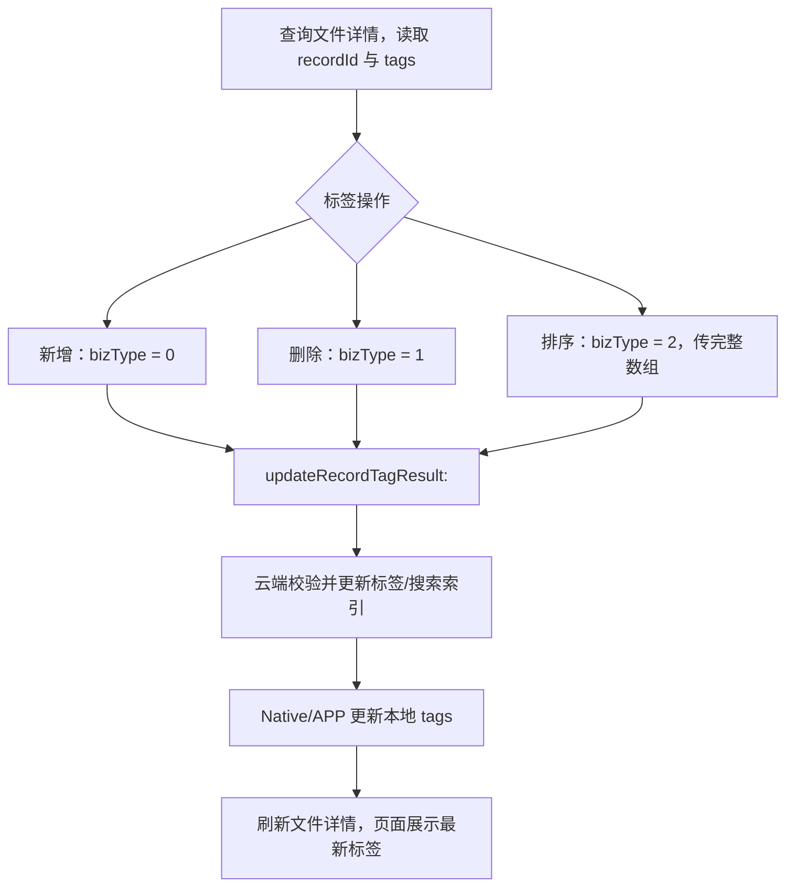

# Tuya AI Voice 对外 Native API

> 录音、转写、翻译与文件管理 Native 接口说明（定制精简版，已裁剪离线传输、音频导入、云同步、合并、小组件等非必要能力）。
> 公开头文件：`<TUniAudioDetectManager/ThingAudioDetectManagerNative.h>`

| 项目 | 说明 |
| --- | --- |
| 入口类 | `ThingAudioDetectManagerNative` |
| 获取方式 | `[ThingAudioDetectManagerNative sharedInstance]` |
| 协议 | `ThingAudioDetectManagerNativeProtocol` |
| 最低 iOS 版本 | iOS 13.0 |
| 原生模型依赖 | `ThingAudioRecordInterface` |

---


## 基础约定

### 获取单例

```objc
#import <TUniAudioDetectManager/ThingAudioDetectManagerNative.h>

ThingAudioDetectManagerNative *manager = [ThingAudioDetectManagerNative sharedInstance];
```

线程安全单例，不支持 `init` / `new`。

### 回调类型

| 类型 | 定义 | 含义 |
| --- | --- | --- |
| `ThingAudioDetectNativeSuccess` | `void(^)(void)` | 操作成功，无返回数据 |
| `ThingAudioDetectNativeFailure` | `void(^)(NSError *)` | 操作失败，`error.code` 为错误码 |

- 标记 `nullable` 的回调可传 `nil`。
- 回调线程由底层决定，更新 UI 需切回主线程。

### 错误域

`ThingAudioDetectManagerNativeErrorDomain`。错误码 `1` 表示底层 `ThingModule` 服务未注册或不可用；其余错误透传底层 SDK 的 `NSError`。

### 错误码参考

底层 SDK 透传的错误码按功能域分段，接入时可根据 `error.code` 进行分类处理和用户提示。

#### 通用错误（10001~10003）

| 错误码 | 枚举值 | 说明 |
| --- | --- | --- |
| 10001 | `ThingAudioRecordInnerError` | 内部错误 |
| 10002 | `ThingAudioRecordPidNotAssociated` | 设备 PID 未关联 Agent |
| 10003 | `ThingAudioRecordLanguageError` | 语言参数错误 |

#### 网络/蓝牙传输错误（10011~10012）

| 错误码 | 枚举值 | 说明 |
| --- | --- | --- |
| 10011 | `ThingAudioRecordNetworkError` | 网络错误 |
| 10012 | `ThingAudioRecordNotExistsError` | 录音记录不存在 |

#### 超时错误（10021~10022）

| 错误码 | 枚举值 | 说明 |
| --- | --- | --- |
| 10021 | `ThingAudioRecordTimeoutError` | 操作超时 |
| 10022 | `ThingAudioRecordCallHangUpError` | 电话挂断导致中断 |

#### 文件操作错误（10031~10033）

| 错误码 | 枚举值 | 说明 |
| --- | --- | --- |
| 10031 | `ThingAudioRecordCreateDirectoryError` | 创建目录失败 |
| 10032 | `ThingAudioRecordCreateFileError` | 创建文件失败 |
| 10033 | `ThingAudioRecordFileRemoteRemoveError` | 远端文件删除失败 |

#### 操作状态错误（10041~10049）

| 错误码 | 枚举值 | 说明 |
| --- | --- | --- |
| 10041 | `ThingAudioRecordOperateError` | 通用操作错误 |
| 10042 | `ThingAudioRecordAlreadyStartError` | 已开始，不能重复开始 |
| 10043 | `ThingAudioRecordAlreadyPauseError` | 已暂停，不能重复暂停 |
| 10044 | `ThingAudioRecordAlreadyResumeError` | 已恢复，不能重复恢复 |
| 10045 | `ThingAudioRecordAlreadyStopError` | 已停止，不能重复停止 |
| 10046 | `ThingAudioRecordAlreadyInRequestError` | 请求进行中，不能重复操作 |
| 10047 | `ThingAudioRecordDeviceAlreadyInRecordError` | 设备已在录音中 |
| 10048 | `ThingAudioRecordDeviceNotInRecordError` | 设备不在录音中 |
| 10049 | `ThingAudioRecordResumeNotInPauseError` | 未处于暂停状态，不能恢复 |

#### 设备错误（10061~10064）

| 错误码 | 枚举值 | 说明 |
| --- | --- | --- |
| 10061 | `ThingAudioRecordDeviceError` | 通用设备错误 |
| 10062 | `ThingAudioRecordDPError` | 设备不支持录音控制 DP |
| 10063 | `ThingAudioRecordDPValueError` | DP 值错误 |
| 10064 | `ThingAudioRecordDeviceNotAllConnect` | 设备未全部连接 |

#### 音频错误（10071~10075）

| 错误码 | 枚举值 | 说明 |
| --- | --- | --- |
| 10071 | `ThingAudioRecordAudioFormatError` | 音频格式错误 |
| 10072 | `ThingAudioRecordAudioNotExistsError` | 音频文件不存在 |
| 10073 | `ThingAudioRecordAudioEngineInitError` | 音频引擎初始化失败 |
| 10074 | `ThingAudioRecordAudioEngineResumeError` | 音频引擎恢复失败，需重新初始化 |
| 10075 | `ThingAudioRecordAudioEngineInterruptResumeError` | 音频引擎中断后恢复失败 |


#### 翻译错误（10100~10101, -1002）

| 错误码 | 枚举值 | 说明 |
| --- | --- | --- |
| 10100 | `ThingAudioTranslateCommonError` | 翻译通用错误 |
| 10101 | `ThingAudioTranslateTTSUrlError` | TTS URL 错误 |
| -1002 | `ThingAudioTranslateFileNotExistError` | 翻译文件不存在 |


#### 分享错误（20201~20204）

| 错误码 | 枚举值 | 说明 |
| --- | --- | --- |
| 20201 | `ThingAudioRecordFileShareSensitiveWordDetected` | 存在敏感内容 |
| 20202 | `ThingAudioRecordFileShareFailed` | 分享通用错误 |
| 20203 | `ThingAudioRecordFileSharePasswordInvalid` | 密码位数错误 |
| 20204 | `ThingAudioRecordFileShareTranscriptRequired` | 缺少转写内容 |


### 关键 ID

| ID | 类型 | 作用 |
| --- | --- | --- |
| `deviceId` | `NSString` | 录音设备标识 |
| `recordId` | `NSString` | 业务录音唯一标识（详情、分享、标签、云端下载） |
| `fileId` | `long long` | 本地文件主键（转写、总结、更新、删除） |
| `asrId` | `long long` | 实时 ASR 分句 ID |
| `sessionId` | `long` | 设备离线文件下载会话 ID |

---


## 一、录音

管理正在进行的录音会话。录音过程中的状态、振幅、实时 ASR 等实时事件通过监听器回调，监听器设置见 1.8。

### 1.1 查询当前任务

```objc
- (nullable ThingAudioRecordObject *)recordTransferTaskWithDeviceId:(NSString *)deviceId;
```

同步查询设备是否存在活动录音任务，进入录音页时调用以恢复状态。

| 参数 | 类型 | 说明 |
| --- | --- | --- |
| `deviceId` | `NSString` | 设备 ID，不能为空 |
| 返回 | `ThingAudioRecordObject` | 活动任务；无任务或服务不可用时为 `nil` |

### 1.2 开始录音

```objc
- (void)startAudioRecordingWithDeviceId:(NSString *)deviceId
                                 config:(ThingAudioRecordConfig *)config
                                success:(void(^)(ThingAudioRecordObject *task))success
                                failure:(ThingAudioDetectNativeFailure)failure;
```

创建并开始录音/实时转写任务。

| 参数 | 类型 | 说明 |
| --- | --- | --- |
| `deviceId` | `NSString` | 录音设备 ID |
| `config` | `ThingAudioRecordConfig` | 录音配置 |
| `success` | block | 成功回调，返回创建后的活动任务 |
| `failure` | block | 失败回调 |

### 1.3 暂停录音

```objc
- (void)pauseRecordTransferWithDeviceId:(NSString *)deviceId
                                success:(ThingAudioDetectNativeSuccess)success
                                failure:(ThingAudioDetectNativeFailure)failure;
```

暂停当前活动录音任务。

| 参数 | 类型 | 说明 |
| --- | --- | --- |
| `deviceId` | `NSString` | 录音设备 ID |
| `success` | block | 成功回调，无返回数据 |
| `failure` | block | 失败回调 |

### 1.4 恢复录音

```objc
- (void)resumeRecordTransferWithDeviceId:(NSString *)deviceId
                                 success:(ThingAudioDetectNativeSuccess)success
                                 failure:(ThingAudioDetectNativeFailure)failure;
```

恢复已暂停的录音任务。

| 参数 | 类型 | 说明 |
| --- | --- | --- |
| `deviceId` | `NSString` | 录音设备 ID |
| `success` | block | 成功回调，无返回数据 |
| `failure` | block | 失败回调 |

### 1.5 结束录音

```objc
- (void)stopRecordTransferWithDeviceId:(NSString *)deviceId
                               success:(ThingAudioDetectNativeSuccess)success
                               failure:(ThingAudioDetectNativeFailure)failure;
```

停止并结束录音任务，停止后数据完成入库。

| 参数 | 类型 | 说明 |
| --- | --- | --- |
| `deviceId` | `NSString` | 录音设备 ID |
| `success` | block | 成功回调，无返回数据 |
| `failure` | block | 失败回调 |

### 1.6 录音过程中更新

```objc
- (void)updateParamsWithDeviceId:(NSString *)deviceId
                          config:(ThingAudioRecordConfig *)config
                         success:(ThingAudioDetectNativeSuccess)success
                         failure:(ThingAudioDetectNativeFailure)failure;
```

录音中更新语言、翻译、TTS、音源或 3A 配置。

| 参数 | 类型 | 说明 |
| --- | --- | --- |
| `deviceId` | `NSString` | 录音设备 ID |
| `config` | `ThingAudioRecordConfig` | 新的录音配置 |
| `success` | block | 成功回调，无返回数据 |
| `failure` | block | 失败回调 |

### 1.7 参数说明

#### ThingAudioRecordObject

开始录音与查询任务返回的活动任务对象。

| 字段 | 类型 | 说明 |
| --- | --- | --- |
| `state` | `ThingAudioRecordState` | 当前录音状态 |
| `userRecordDuration` | `long` | 用户录音时长，单位毫秒 |
| `recordType` | `ThingAudioRecordType` | 录音类型 |
| `recordId` | `NSString` | 业务录音 ID |
| `deviceId` | `NSString` | 当前设备 ID |
| `audioSource` | `ThingAudioSource` | 当前音源 |
| `transferType` | `ThingAudioRecordTransferType` | 文件转写或实时转写 |
| `needTranslate` | `BOOL` | 是否需要翻译 |
| `needTts` | `BOOL` | 是否需要 TTS |
| `originalLanguage` | `NSString` | 源语言 |
| `targetLanguage` | `NSString` | 目标语言 |
| `currentRealTimeTransferRequestId` | `long long` | 当前实时转写请求 ID |
| `businessType` | `ThingAudioBusinessType` | 业务来源 |

#### ThingAudioRecordConfig

开始录音与录音中更新使用的配置对象。

| 字段 | 类型 | 说明 |
| --- | --- | --- |
| `saveDataWhenError` | `BOOL` | 异常时是否保留已录音数据 |
| `recordType` | `ThingAudioRecordType` | 录音类型 |
| `controlTimeout` | `int` | 控制命令超时，单位秒 |
| `dataTimeout` | `int` | 音频数据超时，单位秒 |
| `transferType` | `ThingAudioRecordTransferType` | 转写模式 |
| `agentId` | `NSString` | AI Agent ID，可为空 |
| `originalLanguage` | `NSString` | 源语言，可为空 |
| `targetLanguage` | `NSString` | 目标语言，可为空 |
| `needAsr` | `BOOL` | 是否开启实时 ASR |
| `needTranslate` | `BOOL` | 是否开启翻译 |
| `needTTS` | `BOOL` | 是否开启 TTS |
| `needAmplitude` | `BOOL` | 是否生成振幅数据 |
| `ttsEncode` | `int` | TTS 编码类型 |
| `ttsConfig` | `ThingAudioTTSConfig` | 单设备 TTS 配置 |
| `ttsConfigList` | `NSArray<ThingAudioTTSConfig *>` | 多设备 TTS 配置 |
| `audio3AConfig` | `ThingAudio3AConfig` | 降噪、增益、回声消除配置 |
| `audioRecordUpstreamFormat` | `NSInteger` | 上行格式：0 PCM，1 Opus |
| `audioSource` | `ThingAudioSource` | 主音源 |
| `audioSourceList` | `NSArray<NSNumber *>` | 多音源列表 |
| `businessType` | `ThingAudioBusinessType` | 业务来源：0 Note，1 Translate |
| `needAutoRecognize` | `BOOL` | 是否自动识别语言 |
| `startLivingStatus` | `NSInteger` | 直播状态：0 未开启，1 开启，2 更新参数 |
| `forceCreateToken` | `BOOL` | 是否强制刷新 Token |

> 切换录音通道使用 `switchRecordChannelWithDeviceId:recordChannel:success:failure:`，参数为 `deviceId` 和 `recordChannel: ThingAudioRecordChannel`（枚举见「十三、枚举参考」）。

### 1.8 录音事件监听

录音过程中的状态、振幅、实时 ASR、音质、电量等事件通过 `ThingAudioRecordManagerDelegate` 实时回调。

#### 注册与移除

```objc
// 注册：传入 listener 与 deviceId，按设备隔离
- (void)addRecordListener:(id<ThingAudioRecordManagerDelegate>)listener
                 deviceId:(NSString *)deviceId;

// 移除：必须用同一 listener 实例和同一 deviceId
- (void)removeRecordListener:(id<ThingAudioRecordManagerDelegate>)listener
                    deviceId:(NSString *)deviceId;
```

> - 监听器由调用方强引用，销毁前用同一实例移除。
> - 所有回调保证在主线程，可直接更新 UI。

#### 回调方法

| 回调 | 参数含义 | 触发频率 |
| --- | --- | --- |
| `record:didUpdateStatus:` | `status` 为 `ThingAudioRecordStatus`，含 `state`、`isStarting`、`isPausing` 等 | 状态变更时 |
| `record:didUpdateAmplitude:channel:` | `amplitude` 振幅值；`channel` 声道（Transfer/Call 任务固定为 0） | 约每 200 ms 一次 |
| `record:onProcessResult:` | `result` 实时 ASR/翻译结果 | 实时转写过程中 |
| `record:didFinishWithError:` | `error` 为 nil 表示正常结束 | 录音结束时 |
| `record:onChangeAudioSource:` | `result` 音源切换结果 | 音源切换时 |
| `record:audioDetectQuanlityChangeStatus:` | 音质检测变化 | 音质变化时 |
| `record:phoneDetectBatteryChangeStatus:` | 手机电量检测变化 | 电量变化时 |

#### 完整示例

```objc
@interface RecordViewController () <ThingAudioRecordManagerDelegate>
@property (nonatomic, strong) ThingAudioDetectManagerNative *manager;
@property (nonatomic, copy)   NSString *deviceId;
@end

@implementation RecordViewController

- (void)viewDidLoad {
    [super viewDidLoad];
    self.manager = [ThingAudioDetectManagerNative sharedInstance];
    // 进入页面即注册监听，deviceId 决定接收哪台设备的事件
    [self.manager addRecordListener:self deviceId:self.deviceId];
}

- (void)dealloc {
    // 必须成对移除，使用同一实例与 deviceId
    [self.manager removeRecordListener:self deviceId:self.deviceId];
}

#pragma mark - ThingAudioRecordManagerDelegate

// 录音状态变化：更新按钮（开始/暂停/继续）和计时
- (void)record:(NSString *)deviceId didUpdateStatus:(ThingAudioRecordStatus *)status {
    switch (status.state) {
        case ThingAudioRecordStateOngoing: [self showRecordingUI]; break;
        case ThingAudioRecordStatePaused:  [self showPausedUI];    break;
        case ThingAudioRecordStateFinish:  [self showFinishedUI];  break;
        default: break;
    }
}

// 振幅更新：刷新波形（约每 200ms 一次，主线程回调）
- (void)record:(NSString *)deviceId didUpdateAmplitude:(double)amplitude channel:(NSInteger)channel {
    [self.waveView appendAmplitude:amplitude channel:channel];
}

// 实时转写结果：逐句刷新字幕
- (void)record:(NSString *)deviceId onProcessResult:(ThingAudioRecordProcessResult *)result {
    [self.subtitleView appendText:result.text];
}

// 录音结束：error 为 nil 表示正常结束
- (void)record:(NSString *)deviceId didFinishWithError:(NSError *)error {
    if (error) {
        NSLog(@"录音异常结束：%@", error.localizedDescription);
    } else {
        NSLog(@"录音正常结束");
    }
}

@end
```

---


## 二、文件列表

查询已入库的多条录音文件，支持筛选、排序和游标分页。

### 2.1 获取列表

```objc
- (void)getRecordTransferResultList:(ThingAudioRecordFilesParams *)params
                             success:(void(^)(NSArray<ThingAudioRecordFile *> *list))success
                             failure:(ThingAudioDetectNativeFailure)failure;
```

| 参数 | 类型 | 说明 |
| --- | --- | --- |
| `params` | `ThingAudioRecordFilesParams` | 查询条件 |
| `success` | block | 返回文件数组；无数据时为空数组 |
| `failure` | block | 查询失败回调 |

#### ThingAudioRecordFilesParams 字段

| 字段 | 类型 | 说明 |
| --- | --- | --- |
| `directoryId` | `NSNumber` | 目录 ID；nil 查询所有目录 （暂时不用，预留） |
| `recordType` | `NSNumber` | 录音类型；nil 查询全部类型 |
| `deviceId` | `NSString` | 设备 ID；nil 查询全部设备 |
| `remove` | `NSNumber` | 是否在回收站；nil 不限制 |
| `transfer` | `NSNumber` | 转写状态；nil 查询全部状态 |
| `source` | `NSNumber` | 文件来源：0 AI笔记 1 AI翻译 （对应数据库中两张业务表，无业务区分可暂时不用） |
| `orderBy` | `NSNumber` | 排序字段：0 fileId，1 recordTime，2 updateAt；默认 fileId |
| `asc` | `NSNumber` | 0 降序，1 升序；默认降序 |
| `lastFileId` | `NSNumber` | 文件 ID；第一页传 0 或 nil （暂时不用，预留） |
| `pageSize` | `NSNumber` | 每页数量；0 或 nil 表示底层默认/不分页 （暂时不用，预留） |

> 下一页查询时，将上一页最后一条的 `fileId` 写入 `lastFileId`。

### 2.2 混合搜索

```objc
- (void)searchRecordTransferResult:(ThingAudioRecordSearchMixParams *)params
                            success:(void(^)(NSArray<ThingAudioRecordSearchMixResultItem *> *list))success
                            failure:(ThingAudioDetectNativeFailure)failure;
```

搜索标题、标签和转写内容。

`ThingAudioRecordSearchMixParams` 字段：

| 字段 | 类型 | 说明 |
| --- | --- | --- |
| `content` | `NSString` | 搜索关键词；全空白时返回空列表 |
| `pageNum` | `NSNumber` | 页码，默认 1 |
| `pageSize` | `NSNumber` | 每页数量，默认 20 |

---


## 三、文件详情

按 `recordId` 查询单条已入库录音。

### 3.1 获取详情

```objc
- (void)getRecordTransferResultDetail:(NSString *)recordId
                      amplitudeMaxCount:(NSInteger)amplitudeMaxCount
                               success:(void(^)(ThingAudioRecordFile *file))success
                               failure:(ThingAudioDetectNativeFailure)failure;
```

| 参数 | 类型 | 说明 |
| --- | --- | --- |
| `recordId` | `NSString` | 业务录音 ID，从列表项获取 |
| `amplitudeMaxCount` | `NSInteger` | 最大振幅采样数；0 使用底层默认 100 |
| `success` | block | 返回单条文件详情 |
| `failure` | block | 查询失败回调 |

#### ThingAudioRecordFile 字段

列表与详情返回相同类型。

| 字段 | 类型 | 说明 |
| --- | --- | --- |
| `fileId` | `long long` | 本地文件主键 |
| `recordId` | `NSString` | 业务录音 ID |
| `directoryId` | `long long` | 所属目录 ID （暂时不用，预留） |
| `deviceId` | `NSString` | 来源设备 ID |
| `deviceUniqueId` | `NSString` | 设备生成的文件唯一标识（暂时不用） |
| `name` | `NSString` | 显示名称 |
| `recordTime` | `long long` | 录音开始时间，单位秒 |
| `duration` | `long` | 录音时长，单位毫秒 |
| `recordType` | `ThingAudioRecordType` | 录音类型 |
| `audioFormat` | `ThingAudioRecordAudioFormat` | 音频格式 |
| `source` | `int` | 文件来源：0 AI笔记 1 AI翻译 （对应数据库中两张业务表，无业务区分可暂时不用） |
| `filePath` | `NSString` | 本地音频路径 |
| `wavFilePath` | `NSString` | 本地 WAV 路径（已废弃，返回的还是mp3路径） |
| `amplitudes` | `NSString` | 振幅数据，逗号分隔 |
| `status` | `int` | 云同步状态：0 未上传，1 上传中，2 已上传，3 上传失败 |
| `remove` | `BOOL` | 是否在回收站 |
| `storageKey` | `NSString` | 云同步云端存储 Key |
| `transfer` | `int` | 转写状态：0 未转写，1 转写中，2 已转写，3 转写失败 |
| `summary` | `int` | 总结状态：1 未总结，2 总结中，3 成功，4 失败；0 兼容旧数据 |
| `tranlateState` | `int` | 翻译状态 0 未翻译，1 翻译中，2 已翻译，3 翻译失败 |
| `transferType` | `ThingAudioRecordTransferType` | 文件转写或实时转写 |
| `needTranslate` | `BOOL` | 是否需要翻译 |
| `originalLanguage` | `NSString` | 源语言 |
| `targetLanguage` | `NSString` | 目标语言 |
| `tags` | `NSString` | 标签 JSON 字符串 |
| `cloudSyncStatus` | `NSInteger` | UI 云同步状态 |
| `isFromCloud` | `BOOL` | 是否来自云端 |
| `linkSharedStatus` | `NSInteger` | 分享状态：0 未分享，1 已分享 |
| `summaryImageStatus` | `NSInteger` | 总结图片状态：0 未生成，1 生成中，2 成功，3 失败 |

---


## 四、文件管理

### 4.1 更新文件元数据

```objc
- (void)updateRecordTransferResult:(ThingAudioRecordFileUpdateParams *)params
                            success:(ThingAudioDetectNativeSuccess)success
                            failure:(ThingAudioDetectNativeFailure)failure;
```

`ThingAudioRecordFileUpdateParams` 字段（`fileId` 必填，其余 nil 不更新）：

| 字段 | 类型 | 说明 |
| --- | --- | --- |
| `fileId` | `long long` | 必填，本地文件 ID |
| `name` | `NSString` | 新文件名 |
| `directoryId` | `NSNumber` | 新目录 ID |
| `status` | `NSNumber` | 同步状态 |
| `visit` | `NSNumber` | 是否访问过 |
| `remove` | `NSNumber` | 是否移入回收站 |
| `storageKey` | `NSString` | 云端存储 Key |
| `transfer` | `NSNumber` | 转写状态 |
| `summary` | `NSNumber` | 总结状态 |
| `translateState` | `NSNumber` | 翻译状态 |
| `tags` | `NSString` | 标签 JSON 字符串 |
| `originalLanguage` | `NSString` | 源语言 |
| `targetLanguage` | `NSString` | 目标语言 |

### 4.2 批量删除文件

```objc
- (void)removeFileList:(ThingAudioRecordFilesRemoveParams *)params
               success:(ThingAudioDetectNativeSuccess)success
               failure:(ThingAudioDetectNativeFailure)failure;
```

`ThingAudioRecordFilesRemoveParams` 字段：

| 字段 | 类型 | 说明 |
| --- | --- | --- |
| `fileIds` | `NSArray<NSNumber *>` | 待删除的本地文件 ID 数组 |
| `isDeleteAll` | `BOOL` | YES 同时删除本地和云端；NO 仅本地删除 |

### 4.3 标签操作（详见「五、标签管理」）

```objc
- (void)updateRecordTagResult:(ThingAudioRecordUpdateRecordTagsParams *)params
                      success:(ThingAudioDetectNativeSuccess)success
                      failure:(ThingAudioDetectNativeFailure)failure;
```

`ThingAudioRecordUpdateRecordTagsParams` 字段：

| 字段 | 类型 | 说明 |
| --- | --- | --- |
| `recordId` | `NSString` | 业务录音 ID |
| `bizType` | `NSInteger` | 0 新增，1 删除，2 排序 |
| `tags` | `NSArray<NSString *>` | 标签数组；排序时传完整有序数组 |

### 4.4 本地音频占用空间

```objc
- (void)getAudioFilesSizeWithSuccess:(void(^)(NSInteger size))success
                             failure:(ThingAudioDetectNativeFailure)failure;
```

`size` 单位为字节。

### 4.5 安全路径操作

```objc
- (void)operateAudioFileSafePath:(BOOL)isGetPath
                           params:(ThingAudioRecordMp3FileMoveParams *)params
                          success:(void(^)(NSString *path))success
                          failure:(ThingAudioDetectNativeFailure)failure;
```

生成可分享路径（`isGetPath = YES`）或删除安全路径文件（`isGetPath = NO`）。返回处理后的路径，可为 nil。

`ThingAudioRecordMp3FileMoveParams` 字段：

| 字段 | 获取安全路径时 | 删除安全路径时 |
| --- | --- | --- |
| `fileId` | 可填写源文件 ID | 通常不使用 |
| `mp3FileName` | 源 MP3 文件名或路径 | 不使用 |
| `targetDirectory` | 目标安全目录 | 不使用 |
| `deleteMiniAppilePath` | 不使用 | 待删除的安全路径 |

---


## 五、标签管理

标签以 `recordId` 作为业务归属。文件详情返回的 `tags` 是本地可直接展示的 JSON 字符串；云端标签是跨端同步的业务来源。Native SDK 当前提供标签写入接口，读取标签使用文件列表/详情中的 `tags` 字段，点击标签搜索则复用 `searchRecordTransferResult:`。

### 5.1 核心规则与处理流程

| 规则 | 约定 |
| --- | --- |
| 单条录音上限 | 最多 10 个有效标签，手动标签优先占用名额 |
| 标签长度 | 最多 100 个字符；提交前去除首尾空白，空标签不提交 |
| 标签来源 | `tagSource = 1` 手动添加；`tagSource = 0` AI 生成 |
| 排序 | `sortOrder` 越小越靠前；排序必须提交完整标签数组 |
| 唯一性 | 同一用户、同一 `recordId` 下不允许重复标签 |
| 删除 | 云端软删除；Native/TTT 删除单个标签时只传一个标签 |



处理时遵循以下顺序：

1. 以 `recordId` 定位录音，不要用 `fileId` 代替。
2. 用户新增或删除时，等待 Native 回调成功后再更新页面；失败时保留原标签并展示 `NSError`。
3. 排序时传当前录音的完整、有序标签数组，不要只传发生位置变化的标签。
4. 总结或 AI 标签生成完成后重新查询文件详情，云端返回的 AI 标签不会覆盖手动标签。
5. 多端切换或收到同步提示后重新拉取详情，以云端标签覆盖本地缓存。

### 5.2 Native 标签接口

```objc
- (void)updateRecordTagResult:(ThingAudioRecordUpdateRecordTagsParams *)params
                      success:(ThingAudioDetectNativeSuccess)success
                      failure:(ThingAudioDetectNativeFailure)failure;
```

`ThingAudioRecordUpdateRecordTagsParams` 字段：

| 字段 | 类型 | 说明 |
| --- | --- | --- |
| `recordId` | `NSString` | 必填，业务录音唯一标识 |
| `bizType` | `NSInteger` | `0` 新增，`1` 删除，`2` 排序 |
| `tags` | `NSArray<NSString *>` | 新增/删除传一个标签；排序传完整有序数组 |

调用语义：

- `bizType = 0`：当前 Native/TTT 链路只处理 `tags` 的第一项，成功后追加到标签末尾。
- `bizType = 1`：当前 Native/TTT 链路只处理 `tags` 的第一项，删除不存在的标签按幂等成功处理。
- `bizType = 2`：必须传完整数组，数组下标即云端 `sortOrder`；空数组不用于清空标签。
- `success` 表示云端处理和 APP 本地 `tags` 落库均成功，不代表仅云端成功。
- 公开 Native API 没有单独的历史标签查询方法；需要历史标签时请使用云端 `m.wearable.audio.tag.history`，或由宿主页面自行维护历史数据。

### 5.3 标签展示与搜索

文件详情中的 `ThingAudioRecordFile.tags` 为 JSON 字符串数组。解析后按数组顺序展示；标签点击时将标签名称作为关键词传给 `searchRecordTransferResult:`，搜索标题、标签和转写内容。标签展示、展开/收起属于页面逻辑，不会额外触发标签写入接口。

---


## 六、转写、总结与实时 ASR

### 6.1 Native 处理总流程

转写、总结和翻译是异步的云端处理任务。Native 接入方必须先注册
`ThingAudioRecordSyncManagerDelegate`，再发起任务，并以代理事件中的状态作为最终结果依据。
接口的 `success` 仅表示本次请求阶段成功，**不表示 AI 处理已经完成**。

```mermaid
flowchart TB
    enter["进入详情页或 App 回到前台"] --> ids["保存 fileId + recordId"]
    ids --> listener["addSyncListener:self"]
    listener --> detail["查询文件详情，恢复 transfer / summary 状态"]
    detail --> ready{"正式转写 transfer == 2？"}
    ready -- "否" --> transferParams["组装转写参数：fileId、recordId、language、enableSpeaker"]
    transferParams --> transferReq["processRecordTransferResult taskType=0"]
    ready -- "是" --> choose{"用户发起总结或翻译？"}
    transferReq --> requestResult{"请求阶段 success / failure"}
    requestResult -- "failure" --> requestError["显示 NSError，恢复按钮"]
    requestResult -- "success" --> transferWait["等待 uploadStatusResult"]
    transferWait --> statusFilter["按 item.recordId == recordId 过滤"]
    statusFilter --> transferStatus{"transferStatus"}
    transferStatus -- "1 中" --> transferWait
    transferStatus -- "2 成功" --> transferDone["按 fileId 查询正式转写"]
    transferStatus -- "3 失败" --> transferError["显示转写失败，可重试"]
    transferDone --> choose
    choose -- "总结" --> summaryParams["fileId、recordId、summaryLang、templateCode、enableSpeaker"]
    choose -- "翻译" --> translateParams["fileId、recordId、transLang、language"]
    choose -- "暂不处理" --> end["保持当前状态"]
    summaryParams --> summaryReq["process... taskType=1"]
    translateParams --> translateReq["process... taskType=2"]
    summaryReq --> resultWait["等待 uploadStatusResult"]
    translateReq --> resultWait
    resultWait --> resultFilter["按 recordId 过滤并更新页面状态"]
    resultFilter --> resultBranch{"summaryStatus / translateStatus"}
    resultBranch -- "处理中" --> resultWait
    resultBranch -- "总结成功" --> summaryQuery["按 fileId 查询总结文本"]
    resultBranch -- "翻译成功" --> translateQuery["按 fileId 查询含译文的正式转写"]
    resultBranch -- "失败" --> processError["显示失败原因，允许重试"]
    summaryQuery --> end
    translateQuery --> end
    listener -. "退出页面" .-> remove["removeSyncListener:self"]
    detail -. "fileListUpdate / pushInfo" .-> refresh["重新查询文件详情"]
    refresh --> detail
```

处理规则：

1. 进入文件详情页时注册同步监听，退出或对象销毁时移除同一个监听器实例。
2. 使用 `fileId` 发起任务并查询结果；使用 `recordId` 从全局、批量的状态事件中定位当前录音。
3. 总结和翻译依赖正式转写。`transferStatus != 2` 时，应先发起转写并等待成功，再发起总结或翻译。
4. 状态成功后再查询结果：转写和翻译调用 `getRecordTransferRecognizeResult`，总结调用 `getRecordTransferSummaryResult`。
5. App 回到前台或页面重新进入时，应重新查询文件详情恢复状态，不能假设运行期间一定收到过代理事件。

状态事件与最终结果的关系：

| 事件/字段 | 含义 | 应用处理 |
| --- | --- | --- |
| `processRecordTransferResult` 的 `success` | 请求已提交 | 只更新为“处理中”，不能展示最终完成 |
| `uploadStatusResult.items` | 一批录音的处理状态 | 必须按 `recordId` 过滤当前录音 |
| `transferStatus = 2` | 正式转写完成 | 调用 `getRecordTransferRecognizeResult:fileId:` |
| `summaryStatus = 3` | 总结完成 | 调用 `getRecordTransferSummaryResult:fileId:` |
| `translateStatus = 2` | 翻译完成 | 重新调用 recognize 查询获取译文 |
| `fileListUpdateResult:` | 列表/云同步刷新 | 只作为重新查询详情的信号，不判定 AI 完成 |
| `pushInfoDidRefresh:` | `RecordTranscribe` 推送 | 按 `recordId` 刷新详情，最终仍以状态字段为准 |

> 实时录音产生的 ASR 分句用于录音过程展示；录音结束后的正式转写结果才是总结和翻译的输入。二者不要混用。

### 6.2 注册并处理同步事件

通过 `ThingAudioDetectManagerNative` 注册的监听器，底层对应
`ThingAudioRecordSyncManagerInterface` 的 `ThingAudioRecordSyncManagerDelegate`。该监听器是全局监听，
回调线程不固定；更新 UI 前请切换到主线程。

这与公版小程序的桥接事件流程不同：对外 Native 页面不监听小程序事件，也不经过 JSON Model
转换，而是直接实现该 Delegate、读取原生状态 Model，并调用 Native 结果查询接口。即使本定制接口
裁剪了云同步操作入口，该同步 Delegate 仍是 AI 处理状态的必接通道。

```objc
@interface RecordDetailViewController () <ThingAudioRecordSyncManagerDelegate>
@property (nonatomic, assign) long long fileId;
@property (nonatomic, copy) NSString *recordId;
@end


- (void)viewDidLoad {
    [super viewDidLoad];
    [[ThingAudioDetectManagerNative sharedInstance] addSyncListener:self];
}

- (void)dealloc {
    [[ThingAudioDetectManagerNative sharedInstance] removeSyncListener:self];
}

- (void)uploadStatusResult:(ThingFileUpdateStatusResult *)result {
    for (ThingFileUpdateStatusItem *item in result.items) {
        if (![item.recordId isEqualToString:self.recordId]) {
            continue;
        }

        dispatch_async(dispatch_get_main_queue(), ^{
            if (item.transferStatus == 2) {
                [self loadRecognizeResult]; // 正式转写成功
            } else if (item.transferStatus == 3) {
                [self showProcessFailure:@"转写失败"];
            }

            if (item.summaryStatus == 3) {
                [self loadSummaryResult]; // 总结成功
            } else if (item.summaryStatus == 4) {
                [self showProcessFailure:@"总结失败"];
            }

            if (item.translateStatus == 2) {
                [self loadRecognizeResult]; // 重新读取包含译文的正式转写结果
            } else if (item.translateStatus == 3) {
                [self showProcessFailure:@"翻译失败"];
            }
        });
    }
}

- (void)fileListUpdateResult:(ThingFileListUpdateResult *)result {
    // 全局同步状态，不等同于单条 AI 任务完成。
    // 同步结束或失败后，可重新查询当前文件详情与列表。
}

- (void)pushInfoDidRefresh:(ThingAudioPushRouteInfoConfig *)config {
    if ([config.pushType isEqualToString:@"RecordTranscribe"] &&
        [config.recordId isEqualToString:self.recordId]) {
        // 推送仅作为刷新信号；重新查询详情，最终仍以文件状态为准。
        [self reloadRecordDetail];
    }
}
```

`uploadStatusResult:` 的 `items` 可能一次包含多条录音，必须逐项按 `recordId` 过滤：

| 字段 | 状态值 | Native 页面处理 |
| --- | --- | --- |
| `transferStatus` | 0 未转写，1 转写中，2 成功，3 失败 | 成功后查询正式转写；失败时展示重试入口 |
| `summaryStatus` | 0 兼容旧数据，1 未总结，2 总结中，3 成功，4 失败 | 成功后查询总结结果 |
| `translateStatus` | 0 未翻译，1 翻译中，2 成功，3 失败 | 成功后重新查询正式转写以获取译文 |
| `transcriptionStatus` | 0 不同步，1 未转写，2 部分转写，3 全部转写 | 表示内容同步完整度，不替代 `transferStatus` 的任务状态 |
| `cloudSyncStatus` | 5 上传中，10 上传成功，15 下载中，20 下载成功，-10 上传失败，-20 下载失败 | 用于展示音频同步状态，不替代 AI 处理状态 |
| `operateStatus` | 0 未知，1 新增，2 修改，3 删除 | 标签或其他局部文件字段的操作类型，只作为刷新提示 |
| `tags` | `NSArray<NSString *>` 或 nil | 本次状态事件携带的本地标签快照；nil 表示未下发标签字段 |
| `summaryImageStatus` | 0 未生成，1 生成中，2 成功，3 失败 | 总结图片状态，不代表总结文本状态 |

`fileListUpdateResult:` 描述全局同步任务：`syncStatus` 为 0 成功/隐藏、1 同步中、2 失败、-1
同步开关关闭；`errorCode` 为 0 无错误、10001 网络错误、10002 仅 Wi-Fi 时断开、10003 上传超时。
它适合驱动列表级刷新，不应据此判定某一条转写、总结或翻译已经完成。

### 6.3 发起离线处理任务（转写、总结、翻译）

```objc
- (nullable NSString *)processRecordTransferResult:(ThingAudioRecordUploadFileParams *)params
                             taskType:(NSInteger)taskType
                             progress:(void(^)(double progress, int status))progress
                              success:(ThingAudioDetectNativeSuccess)success
                              failure:(ThingAudioDetectNativeFailure)failure;
```

| 参数 | 类型 | 说明 |
| --- | --- | --- |
| `params` | `ThingAudioRecordUploadFileParams` | 处理参数 |
| `taskType` | `NSInteger` | 0 转写，1 总结，2 翻译 |
| `progress` | `void (^)(double progress, int status)` | 仅转写任务使用；文件上传进度回调，`progress` 为上传进度，`status` 为上传状态（0 开始、1 更新、2 结束、3 取消），二者都不是 AI 最终完成事件 |
| `success` | `ThingAudioDetectNativeSuccess` | 请求阶段成功；最终结果必须监听同步事件 |
| `failure` | `ThingAudioDetectNativeFailure` | 请求阶段失败，返回 `NSError` |
| 返回值 | `NSString *` | 转写任务 ID，可用于取消底层任务；总结、翻译返回 nil |

`ThingAudioRecordUploadFileParams` 字段：

| 字段 | 类型 | 说明 |
| --- | --- | --- |
| `fileId` | `long long` | 待处理文件 ID |
| `recordId` | `NSString` | 业务录音 ID |
| `templateCode` | `NSString` | 总结模板编码 |
| `language` | `NSString` | ASR 倾向识别语言 |
| `enableSpeaker` | `BOOL` | 是否开启说话人识别 |
| `transLang` | `NSString` | 翻译目标语言 |
| `summaryLang` | `NSString` | 总结语言 |

按任务类型传参：

| `taskType` | 必须传递/建议传递的字段 | 说明 |
| --- | --- | --- |
| `0` 转写 | `fileId`、`recordId`、`language`、`enableSpeaker` | `language` 只是 ASR 倾向语言；`enableSpeaker` 控制说话人识别 |
| `1` 总结 | `fileId`、`recordId`、`summaryLang`；可选 `templateCode`、`enableSpeaker` | `summaryLang` 是总结输出语言；`templateCode` 来自总结模板接口，nil 使用默认模板 |
| `2` 翻译 | `fileId`、`recordId`、`transLang`；可选 `language` | `transLang` 是翻译目标语言，必须是服务端支持的语言编码 |

`fileId` 与 `recordId` 必须来自同一条文件详情，不能混用其他录音的 ID。`success` 返回前，转写可能同步返回任务 ID；总结和翻译通常返回 nil，三类任务的最终完成都必须依赖同步 Delegate。

### 6.4 最终结果查询

| 方法 | 参数 | 返回 |
| --- | --- | --- |
| `getRecordTransferRecognizeResult:success:failure:` | `fileId: long long` | 正式转写结果；翻译成功后也调用此方法读取含译文的结果 |
| `saveRecordTransferRecognizeResult:text:success:failure:` | `fileId`、`text: NSString` | 无数据 |
| `getRecordTransferSummaryResult:success:failure:` | `fileId: long long` | `NSString *text` |
| `saveRecordTransferSummaryResult:text:success:failure:` | `fileId`、`text: NSString` | 无数据 |

只有对应状态进入成功值后才查询结果。`uploadStatusResult:` 的失败项不携带 `NSError`；此时展示对应失败状态并允许重试，必要时重新查询文件详情。调用接口本身的参数、网络或服务错误则由 `failure` 返回底层 `NSError`。

### 6.5 可直接复用的 Native 实现

下面示例把监听注册、参数组装、状态过滤和最终结果查询放在同一个详情控制器中。生产代码可以将 `showStatus:`、`showText:` 和 `reloadDetail` 替换为实际 UI 更新方法。

```objc
@interface RecordProcessViewController () <ThingAudioRecordSyncManagerDelegate>
@property (nonatomic, assign) long long fileId;
@property (nonatomic, copy) NSString *recordId;
@property (nonatomic, assign) NSInteger pendingTaskType; // -1 无任务，0 转写，1 总结，2 翻译
@end

- (void)viewDidAppear:(BOOL)animated {
    [super viewDidAppear:animated];
    self.pendingTaskType = -1;
    [[ThingAudioDetectManagerNative sharedInstance] addSyncListener:self];
    [self reloadDetail];
}

- (void)viewWillDisappear:(BOOL)animated {
    [super viewWillDisappear:animated];
    [[ThingAudioDetectManagerNative sharedInstance] removeSyncListener:self];
}

- (void)startTask:(NSInteger)taskType {
    ThingAudioRecordUploadFileParams *params = [ThingAudioRecordUploadFileParams new];
    params.fileId = self.fileId;                 // 本地文件主键：发起任务和查询结果使用
    params.recordId = self.recordId;             // 业务录音 ID：同步事件过滤使用
    params.language = @"zh";                    // ASR 倾向语言，不代表最终识别语言
    params.enableSpeaker = NO;                  // 是否开启说话人识别
    if (taskType == 1) {
        params.summaryLang = @"zh";             // 总结输出语言
        params.templateCode = nil;               // nil 使用服务端默认模板
    } else if (taskType == 2) {
        params.transLang = @"en";               // 翻译目标语言
    }

    self.pendingTaskType = taskType;
    NSString *taskId = [[ThingAudioDetectManagerNative sharedInstance]
        processRecordTransferResult:params
        taskType:taskType
        progress:^(double progress, int status) {
            dispatch_async(dispatch_get_main_queue(), ^{
                [self showStatus:[NSString stringWithFormat:@"文件上传中 %.0f%%（status=%d）", progress, status]];
            });
        }
        success:^{
            // success 只表示请求已提交；最终状态等待 uploadStatusResult:
        }
        failure:^(NSError *error) {
            dispatch_async(dispatch_get_main_queue(), ^{
                self.pendingTaskType = -1;
                [self showStatus:error.localizedDescription];
            });
        }];
    [self showStatus:taskId.length > 0 ? [NSString stringWithFormat:@"任务已提交：%@", taskId] : @"任务已提交"];
}

- (void)uploadStatusResult:(ThingFileUpdateStatusResult *)result {
    dispatch_async(dispatch_get_main_queue(), ^{
        for (ThingFileUpdateStatusItem *item in result.items) {
            if (![item.recordId isEqualToString:self.recordId]) continue;

            if (item.transferStatus == 2) {
                [self fetchRecognizeResult];
                if (self.pendingTaskType == 0) self.pendingTaskType = -1;
            } else if (item.transferStatus == 3) {
                [self showStatus:@"转写失败，可重新发起 taskType=0"];
                if (self.pendingTaskType == 0) self.pendingTaskType = -1;
            }

            if (item.summaryStatus == 3) {
                [self fetchSummaryResult];
                if (self.pendingTaskType == 1) self.pendingTaskType = -1;
            } else if (item.summaryStatus == 4) {
                [self showStatus:@"总结失败，可重新发起 taskType=1"];
                if (self.pendingTaskType == 1) self.pendingTaskType = -1;
            }

            if (item.translateStatus == 2) {
                [self fetchRecognizeResult]; // 正式转写结果中包含译文
                if (self.pendingTaskType == 2) self.pendingTaskType = -1;
            } else if (item.translateStatus == 3) {
                [self showStatus:@"翻译失败，可重新发起 taskType=2"];
                if (self.pendingTaskType == 2) self.pendingTaskType = -1;
            }
        }
    });
}

- (void)fileListUpdateResult:(ThingFileListUpdateResult *)result {
    if (result.syncStatus == 1) return;
    [self reloadDetail]; // 列表同步事件只作为刷新信号
}

- (void)pushInfoDidRefresh:(ThingAudioPushRouteInfoConfig *)config {
    if ([config.pushType isEqualToString:@"RecordTranscribe"] &&
        [config.recordId isEqualToString:self.recordId]) {
        [self reloadDetail];
    }
}

- (void)fetchRecognizeResult {
    [[ThingAudioDetectManagerNative sharedInstance]
        getRecordTransferRecognizeResult:self.fileId
        success:^(NSString *text) { [self showText:text]; }
        failure:^(NSError *error) { [self showStatus:error.localizedDescription]; }];
}

- (void)fetchSummaryResult {
    [[ThingAudioDetectManagerNative sharedInstance]
        getRecordTransferSummaryResult:self.fileId
        success:^(NSString *text) { [self showText:text]; }
        failure:^(NSError *error) { [self showStatus:error.localizedDescription]; }];
}
```

实现要点：不要把 `success` 当作 AI 完成事件；不要用 `fileId` 过滤 `uploadStatusResult.items`；页面重进、前后台切换和推送到达后都应重新查询文件详情。

### 6.6 实时录音时的 ASR

```objc
- (void)getRecordTransferRealTimeResult:(ThingAudioRecordAsrsParams *)params
                                 success:(void(^)(NSArray<ThingAudioRecordAsrResult *> *list))success
                                 failure:(ThingAudioDetectNativeFailure)failure;
```

`ThingAudioRecordAsrsParams` 字段：

| 字段 | 类型 | 说明 |
| --- | --- | --- |
| `fileId` | `NSNumber` | 按本地文件 ID 查询 |
| `recordId` | `NSString` | 按业务录音 ID 查询 |
| `asrId` | `NSNumber` | 查询小于等于该 ID 的 ASR 数据 |

更新单条 ASR 分句：

```objc
- (void)saveRecordTransferRealTimeRecognizeResult:(ThingAudioRecordAsrUpdateParams *)params
                                          success:(ThingAudioDetectNativeSuccess)success
                                          failure:(ThingAudioDetectNativeFailure)failure;
```

`ThingAudioRecordAsrUpdateParams` 字段：

| 字段 | 类型 | 说明 |
| --- | --- | --- |
| `asrId` | `long long` | 必填，待更新的 ASR 分句 ID |
| `text` | `NSString` | 展示文本 |
| `asr` | `NSString` | ASR 原文 |
| `translate` | `NSString` | 翻译文本 |
| `ttsPath` | `NSString` | TTS 音频路径 |
| `endTime` | `NSNumber` | 分句结束时间，单位毫秒 |
| `status` | `NSNumber` | 0 未完成，1 成功，2 失败 |
| `channel` | `NSNumber` | 声道：0 左声道，1 右声道 |

---


## 七、云端接口

通过涂鸦云端 API 获取语言列表和总结模板列表，用于录音语言选择和总结模板选择。调用方式统一使用 `ThingSmartRequest`。

### 7.1 获取语言列表

```objc
NSDictionary *postData = @{@"source": @[@"asr-llm"]};
[[ThingSmartRequest new] requestWithApiName:@"m.wearable.audio.translate.lang.list"
                                  postData:postData
                                   version:@"1.0"
                                   success:^(id result) {
    // result 包含语言列表
} failure:^(NSError *error) {
    // 请求失败
}];
```

| 参数 | 类型 | 说明 |
| --- | --- | --- |
| apiName | `NSString` | `m.wearable.audio.translate.lang.list` |
| postData | `NSDictionary` | `@{@"source": @[@"asr-llm"]}` 或 `@[@"asr-llm-tts"]` |
| version | `NSString` | `1.0` |

**source 可选值**：

| 值 | 说明 |
| --- | --- |
| `asr-llm` | 仅 ASR + LLM 能力 |
| `asr-llm-tts` | 含 TTS 能力 |

**返回结构**：`success` 回调中的 `result` 为语言数组。

语言对象字段：

| 字段 | 类型 | 说明 |
| --- | --- | --- |
| `code` | `NSString` | 语言编码，传给录音、转写、翻译、总结等接口的语言参数 |
| `selfDescribing` | `NSString` | 语言展示名称 |

返回示例：

```json
[
  {
    "selfDescribing": "中文（简体）",
    "code": "zh"
  },
  {
    "selfDescribing": "English",
    "code": "en"
  },
  {
    "selfDescribing": "日本語",
    "code": "ja"
  },
  {
    "selfDescribing": "한국어",
    "code": "ko"
  },
  {
    "selfDescribing": "Deutsch",
    "code": "de"
  },
  {
    "selfDescribing": "Français",
    "code": "fr"
  },
  {
    "selfDescribing": "Русский",
    "code": "ru"
  },
  {
    "selfDescribing": "ไทย",
    "code": "th"
  },
  {
    "selfDescribing": "Bahasa Indonesia",
    "code": "id"
  }
]
```

### 7.2 获取总结模板列表

```objc
[[ThingSmartRequest new] requestWithApiName:@"m.wearable.summary.template.recommend.list.get"
                                  postData:nil
                                   version:@"1.0"
                                   success:^(id result) {
    // result 包含模板列表
} failure:^(NSError *error) {
    // 请求失败
}];
```

| 参数 | 类型 | 说明 |
| --- | --- | --- |
| apiName | `NSString` | `m.wearable.summary.template.recommend.list.get` |
| postData | `NSDictionary` | `nil` |
| version | `NSString` | `1.0` |

**返回结构**：`result` 为分组数组，每个分组含模板列表。

外层字段：

| 字段 | 类型 | 说明 |
| --- | --- | --- |
| `result` | `NSArray` | 分组数组 |
| `success` | `BOOL` | 请求是否成功 |
| `status` | `NSString` | 状态，成功为 `"ok"` |

分组对象字段：

| 字段 | 类型 | 说明 |
| --- | --- | --- |
| `nodeCode` | `NSString` | 分组编码，如 `recommend`（推荐）、`universal`（通用）、`content_interview`（内容与访谈）、`industry_expert`（行业专家） |
| `nodeName` | `NSString` | 分组名称，如「推荐」「通用」 |
| `templates` | `NSArray` | 该分组下的模板列表 |

模板对象字段：

| 字段 | 类型 | 说明 |
| --- | --- | --- |
| `id` | `NSString` | 模板 ID |
| `templateCode` | `NSString` | **模板编码，传给 `processRecordTransferResult` 的 `templateCode` 参数** |
| `templateName` | `NSString` | 模板名称，如「AI 智能匹配」「会议」「通用总结」 |
| `templateDesc` | `NSString` | 模板描述，如「AI根据内容自动选择」「提取纪要与待办」 |
| `icon` | `NSString` | 模板图标 URL |
| `sort` | `NSInteger` | 分组内排序，数字越小越靠前 |
| `customize` | `BOOL` | 是否自定义模板 |
| `needColorAdapt` | `BOOL` | 图标是否需要颜色适配 |
| `objectKey` | `NSString` | 图标对象 Key（用于缓存等） |

---


## 八、分享链接

按业务录音 ID 生成可分享的链接，支持设置过期时间与密码。

### 8.1 分享链接

```objc
- (void)operateRecordShareLink:(ThingAudioLinkShareConfig *)config
                       success:(void(^)(NSString *shareLink))success
                       failure:(ThingAudioDetectNativeFailure)failure;
```

`ThingAudioLinkShareConfig` 字段：

| 字段 | 类型 | 说明 |
| --- | --- | --- |
| `recordId` | `NSString` | 待分享的业务录音 ID |
| `shareTypes` | `NSArray<NSString *>` | 分享类型数组 |
| `expireTime` | `NSInteger` | 分享链接过期时间 |
| `password` | `NSString` | 分享密码，可为空 |
| `shareStatus` | `NSInteger` | 1 开启/分享中，2 关闭分享 |

---


## 九、文本翻译

### 9.1 发起文本翻译

```objc
- (void)startTranslate:(ThingTextTranslateRequestParams *)params
               success:(void(^)(ThingTextTranslateResultParams *result))success
               failure:(ThingAudioDetectNativeFailure)failure;
```

发起一段文本翻译，返回翻译结果。

`ThingTextTranslateRequestParams` 字段：

| 字段 | 类型 | 说明 |
| --- | --- | --- |
| `q` | `NSString` | 必填，待翻译文本 |
| `from` | `NSString` | 源语言；可用 `auto` 自动检测 |
| `to` | `NSString` | 必填，目标语言 |

`ThingTextTranslateResultParams` 字段：

| 字段 | 类型 | 说明 |
| --- | --- | --- |
| `taskId` | `NSString` | 翻译任务 ID |
| `taskStatus` | `NSInteger` | 任务状态 |
| `translation` | `NSString` | 翻译结果 |
| `timbreUrl` | `NSString` | 同声传译音色 URL |

### 9.2 查询翻译历史列表

```objc
- (void)getTranslateFileList:(ThingAudioRecordTranslateFilesParams *)params
                     success:(void(^)(NSArray<ThingAudioRecordTranslateFile *> *list))success
                     failure:(ThingAudioDetectNativeFailure)failure;
```

`ThingAudioRecordTranslateFilesParams` 字段：

| 字段 | 类型 | 说明 |
| --- | --- | --- |
| `directoryId` | `long long` | 目录 ID；0 不过滤 |
| `deviceId` | `NSString` | 设备 ID；nil 不过滤 |
| `recordType` | `int` | 录音类型 |
| `source` | `int` | 文件来源：0 AI笔记，1 AI翻译（对应数据库两张业务表，无业务区分可暂时不用） |
| `noteFileId` | `long long` | 对应的 Note 文件 ID |
| `orderBy` | `int` | 排序字段：0 fileId，1 recordTime，2 updateAt |
| `asc` | `int` | 0 降序，1 升序 |
| `lastFileId` | `long long` | 分页游标，第一页传 0 |
| `pageSize` | `int` | 每页数量，0 使用底层默认 |

### 9.3 查询翻译详情

```objc
- (void)getTranslateFileDetail:(ThingAudioRecordTranslateDetailFileParams *)params
                       success:(void(^)(ThingAudioRecordTranslateFile *file))success
                       failure:(ThingAudioDetectNativeFailure)failure;
```

`ThingAudioRecordTranslateDetailFileParams` 字段：

| 字段 | 类型 | 说明 |
| --- | --- | --- |
| `fileId` | `long long` | 翻译文件 ID |
| `amplitudeMaxCount` | `int` | 振幅采样上限 |

### 9.4 翻译发送给 AINote

```objc
- (void)sendToNote:(ThingAudioRecordTranslateFileMoveToNoteParams *)params
            success:(void(^)(ThingAudioRecordTranslateFileMoveToNoteResult *result))success
            failure:(ThingAudioDetectNativeFailure)failure;
```

将翻译文件转成 Note 并触发上传同步。

`ThingAudioRecordTranslateFileMoveToNoteParams` 字段：

| 字段 | 类型 | 说明 |
| --- | --- | --- |
| `translateFileId` | `long long` | 必填，待转换的翻译文件 ID |
| `amplitudeMaxCount` | `NSNumber` | 振幅采样上限，可为空 |

### 9.5 批量删除翻译记录

```objc
- (void)batchRemoveTranslationFiles:(ThingAudioRecordTranslateFilesRemoveParams *)params
                            success:(ThingAudioDetectNativeSuccess)success
                            failure:(ThingAudioDetectNativeFailure)failure;
```

`ThingAudioRecordTranslateFilesRemoveParams` 字段：

| 字段 | 类型 | 说明 |
| --- | --- | --- |
| `fileIds` | `NSArray<NSNumber *>` | 待删除的翻译文件 ID 数组 |

---


## 十、设备

查询耳机蓝牙连接状态与控制录音悬浮窗。

| 方法 | 作用 | 参数 / 返回 |
| --- | --- | --- |
| `getEarPhoneBTConnectedStatus:success:failure:` | 查询耳机蓝牙连接状态 | `deviceId: NSString`；返回 `connected: BOOL` |
| `operateRecordingFloat:success:failure:` | 显示或隐藏原生录音悬浮窗 | `visible: BOOL` |

---


## 十一、事件监听

其他业务模块的监听器。录音监听器（`ThingAudioRecordManagerDelegate`）见一、录音 → 1.8。

监听器必须由调用方强引用，销毁前用同一实例移除。带 `deviceId` 的按设备隔离，不带的为全局监听。

| 注册 | 移除 | Listener 协议 | 作用域 |
| --- | --- | --- | --- |
| `addSyncListener:` | `removeSyncListener:` | `ThingAudioRecordSyncManagerDelegate` | 全局；转写/总结/翻译处理见 6.2 |
| `addDeviceListener:deviceId:` | `removeDeviceListener:deviceId:` | `ThingAudioRecordDeviceManageManagerDelegate` | 指定设备 |

同步监听器用于接收单条录音的转写、总结、翻译状态，以及列表同步和推送刷新事件；设备监听器用于接收耳机蓝牙连接状态等设备能力变化事件。

---


## 十二、枚举参考

### 录音状态 ThingAudioRecordState

| 值 | 含义 |
| --- | --- |
| 0 | 未知 |
| 1 | 录音中 |
| 2 | 已暂停 |
| 3 | 已结束 |

### 录音类型 ThingAudioRecordType

| 值 | 含义 |
| --- | --- |
| 0 | 电话录音 |
| 1 | 会议录音 |
| 2 | 同声传译 |
| 3 | 面对面翻译 |
| 5 | 音频导入 |

### 录音通道 ThingAudioRecordChannel

| 值 | 含义 |
| --- | --- |
| 0 | Opus/BLE 通道 |
| 1 | 系统蓝牙通道 |
| 2 | 手机麦克风通道 |

### 转写类型 ThingAudioRecordTransferType

| 值 | 含义 |
| --- | --- |
| 0 | 录制完成后文件转写 |
| 1 | 录音过程中实时转写 |


### 业务类型 ThingAudioBusinessType

| 值 | 含义 |
| --- | --- |
| 0 | Note |
| 1 | Translate |


## 使用要点

1. **开始录音前先查任务**：调用 `recordTransferTaskWithDeviceId:` 避免同一设备重复开始录音。
2. **区分 `recordId` 与 `fileId`**：详情、分享、标签、云端下载用 `recordId`；转写、总结、更新、删除用 `fileId`。
5. **监听成对调用**：add/remove 使用同一 listener 引用；设备监听还需同一 `deviceId`。
6. **回调线程不固定**：UI 更新需切回主线程。
